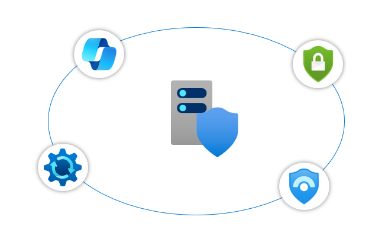

# Server Security Hands-on

## 目的

本ハンズオンを通して サーバーサイド の セキュリティ強化方法 について学びます。

## 目標

サーバーサイドのセキュリティ強化にかかわる以下のソリューションの扱いについて学習します。

- Defender for Cloud
- Azure Update Manager
- Microsoft Sentinel
- Microsoft Security Copilot

## 対象

以下のような方を対象として想定しています。

- クラウド管理者​
- クラウドアーキテクト​
- ネットワークエンジニア​
- セキュリティ管理者​
- セキュリティアーキテクト

## 前提条件

- ハンズオンを実施するためには サブスクリプション が必要です。
- 本ハンズオン用にサブスクリプションを用意するのが推奨です。
  既存サブスクリプションを再利用する場合、 Defender for Cloud の設定が既存システムに影響します。
- 参加者には以下の権限が必要です。
    - サブスクリプションに対する `所有者 (Owner)` (*1)
    - `セキュリティ管理者 (Security Administrator)` (*2) (*3)

(*1) Defender の設定変更操作に必要。 共同作作成者だと設定変更ができない。  
(*2) Sentinel の データコネクタ 設定 に必要。
(*3) Privileged Identity Management (PIM) を有効化している場合、 `グローバル管理者` が必要

## ハンズオン 目次

事前準備
1. [ハンズオン環境準備](./docs/00-init-infra.md) （3 ~ 5分）

ハンズオン手順

- Defender for Cloud
    1. [Defender for Cloud の適用](./docs/10-defender.md) （10 ~ 15分）
    1. [Defender for Cloud の活用](./docs/20-defender.md) （10 ~ 15分）
- Azure Update Manager
    1. [Update Manager の利用](./docs/30-updatemanager.md) （10 ~ 15分）
- Microsoft Sentinel
    1. [Microsoft Sentinel の構築](./docs/40-sentinel.md) （3 ~ 5分）
    1. [Microsoft Sentinel へログの集約](./docs/50-dataconnector.md) （20 ~ 30分）
    1. [UEBAの有効化](./docs/60-ueba.md) （2 ~ 5分）

        ＝可能ならここでいったん区切って日を改める。データ収集をさせるため。＝

    1. [Microsoft Sentinel を使った インシデント対応](./docs/70-sentinel.md) （30 ~ 45分）
- Microsoft Security Copilot
    1. [Microsoft Security Copilot の活用](./docs/80-copilotforsecurity.md) （12 ~ 20分）

