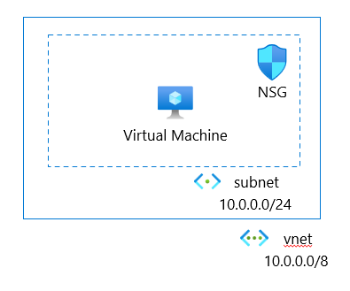
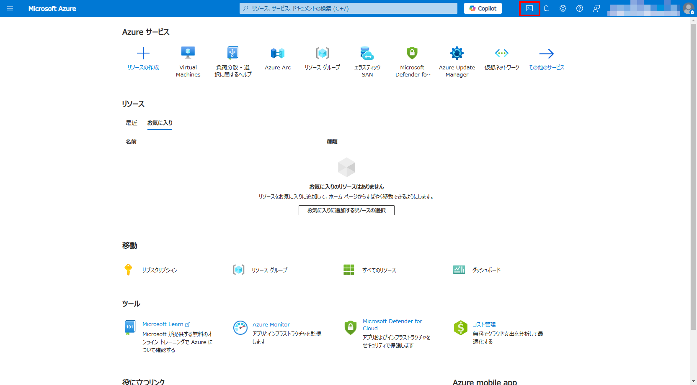
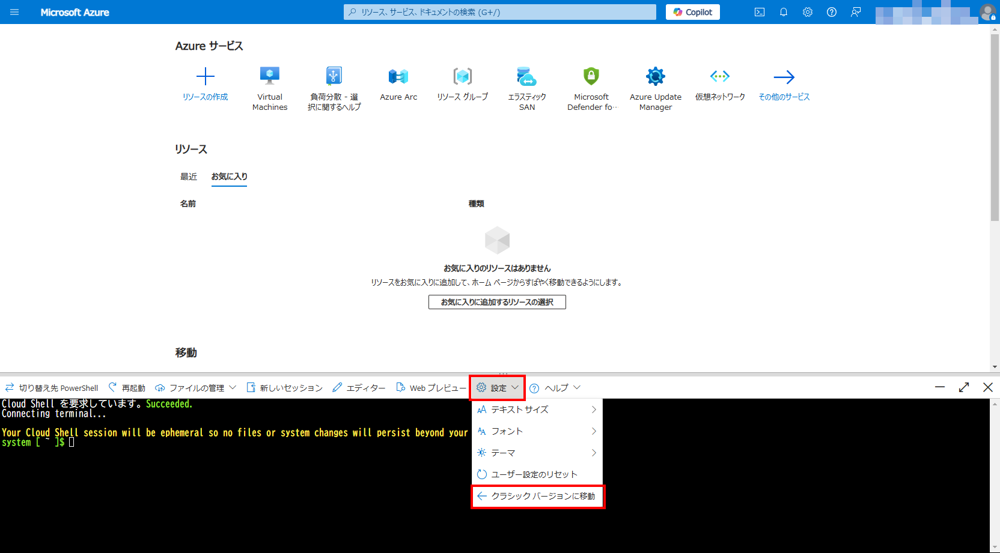

# 前提環境の構築

#### ⏳ 推定時間

- 3 ~ 5分

#### 💡 学習概要

本ハンズオンでは単純な仮想マシンを保護対象とし、さまざまなセキュリティ対策を行っていきます。
準備する環境は以下のような単純な環境です。



「ARMテンプレート」 または 「terraform」 を利用してデプロイが可能です。
どちらかの方法でデプロイを行います。

#### 🗒️ 目次

- [ARMテンプレート を使って デプロイ](#armテンプレート-を使って-デプロイ)
- [terraform を使って デプロイ](#terraform-を使って-デプロイ)

> [!IMPORTANT]
> 仮想マシンへRDP接続できない場合、上記でデプロイした仮想ネットワークに AzureBastionSubnet があるので、
> そこへ Bastion (Basic) を別途手動でデプロイします。

- [Bastion のデプロイ (オプション)]()

## ARMテンプレート を使って デプロイ

1. 以下のリンクから カスタムデプロイ を開く

    [](https://portal.azure.com/#create/Microsoft.Template/uri/https%3A%2F%2Fraw.githubusercontent.com%2Fatsugoms%2Fhandson-server-security%2Frefs%2Fheads%2Fdevelop%2Finfra%2Farm%2Ftemplate.json)

    (*) 直接ファイル展開したい場合: [🗒️ JSONファイル](https://raw.githubusercontent.com/atsugoms/handson-server-security/refs/heads/develop/infra/arm/template.json) 

1. カスタムデプロイ

    入力項目を埋めて「確認と作成」


## terraform を使って デプロイ

1. Azure ポータルを開く

    https://portal.azure.com/

1. Cloud Shell (Bash) を起動

    (*) PowerShell になっている場合、 Bash に切り替える

    

1. [設定]-[クラシックバージョンに移動]

    

1. リポジトリをクローン

    ```
    git clone https://github.com/atsugoms/handson-server-security.git
    ```

1. `infra/terraform` フォルダへ移動

    ```
    cd ./handson-server-security/infra/terraform/
    ```

1. 変数ファイルを作成

    ```
    code ./terraform.tfvars
    ```

    ファイルの内容は以下の通り

    `/infra/terraform/terraform.tfvars`
    ```
    project         = "<PROJECT_NAME>"
    environment     = "<ENVIRONMENT_NAME>"
    vm_username     = "<YOUR_VM_USERNAME>"
    vm_password     = "<YOUR_VM_PASSWORD>"
    subscription_id = "xxxxxxxx-xxxx-xxxx-xxxx-xxxxxxxxxxxx"
    tenant_id       = "xxxxxxxx-xxxx-xxxx-xxxx-xxxxxxxxxxxx"
    ```

<!--
1. Azure へログイン

    ```
    az login --use-device-code
    ```
-->

1. サブスクリプションの選択 

    ```
    az account set --subscription <SUBSCRIPTION_ID>
    ```

1. リソースのデプロイ

    ```
    terraform init
    terraform apply
    ```


## Bastionのデプロイ（オプション）

1. Azure ポータルを開き、Azure Bastion を開きます

1. 「作成」を選択

1. Bastion の作成

    1. 基本

        - プロジェクト詳細
            - サブスクリプション： (ハンズオンで利用するもの)
            - リソースグループ: (上記の初期ネットワーク構築で作成したもの)
        - インスタンスの詳細
            - 名前: (任意)
            - リージョン: (リソースグループと同じ)
            - レベル: `Basic`
            - インスタンス数: `2`
        - 仮想ネットワークを構成
            - 仮想ネットワーク: (上記の初期ネットワーク構築で作成したもの)
            - サブネット: `AzureBastionSubnet` (自動選択)
        - パブリックIPアドレス
            - パブリックIPアドレス: `新規作成`
            - パブリックIPアドレス名: (任意)
    
    1. 詳細設定

        デフォルトまま

        - コピー/貼り付け

    1. タグ

        なし

    1. 確認および作成

        内容を確認して「作成」
