# Ex01: Defender for Cloud の適用

#### ⏳ 推定時間

- 10 ~ 15分

#### 💡 学習概要

Defender for Cloud に含まれる機能を有効化し、活用していく方法を学習します。

#### 🗒️ 目次

Defender CSPM
1. [Defender CSPM の有効化](#defender-cspm-の有効化)

Defender for Servers
1. [Defender for Servers の有効化](#defender-for-servers-の有効化)
1. [Defender for Endpoint の展開](#defender-for-endpoint-の展開)
1. [脆弱性評価の展開](#脆弱性評価の展開)

参考
* [Defender for Servers の個別適用](#参考-defender-for-servers-の個別適用)

## Defender CSPM の有効化

Defender for Cloud は基本的にサブスクリプション単位で有効/無効を切り替えます。
一部の機能ではリソース単位での有効/無効の切り替えをサポートしていますが、機能によって個別適用の方法が異なります。
まずは Defender CSPM を例に基本となるサブスクリプション単位での有効化について学習します。

1. [Azure ポータル](https://portal.azure.com/) を開く

1. 上部の検索窓を使って Defender for Cloud を探して開く

    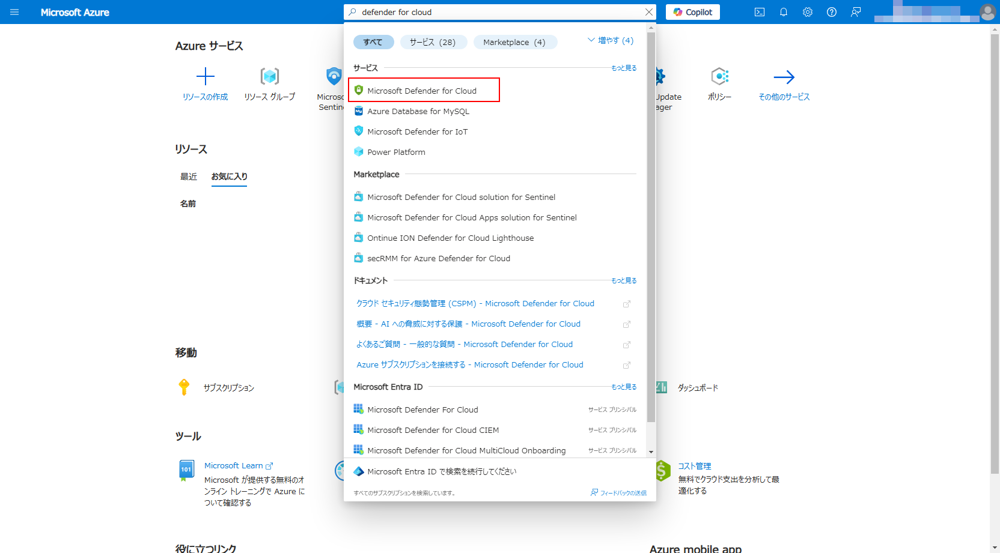

1. [管理]-[環境設定] を開く

    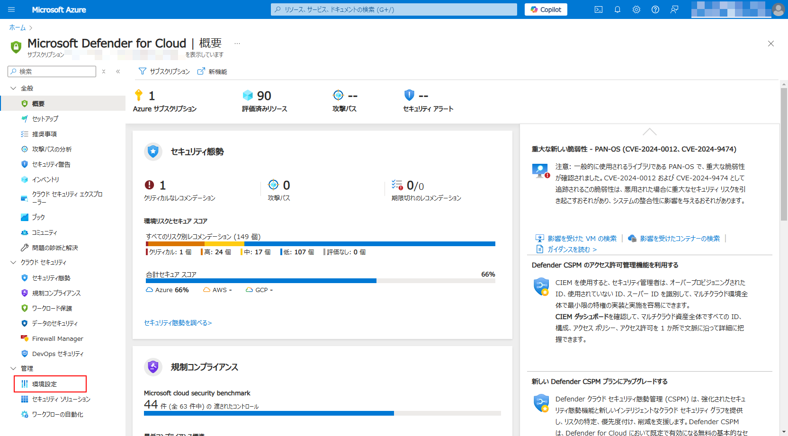

1. 管理グループを展開し、ハンズオンで利用するサブスクリプションを選択

    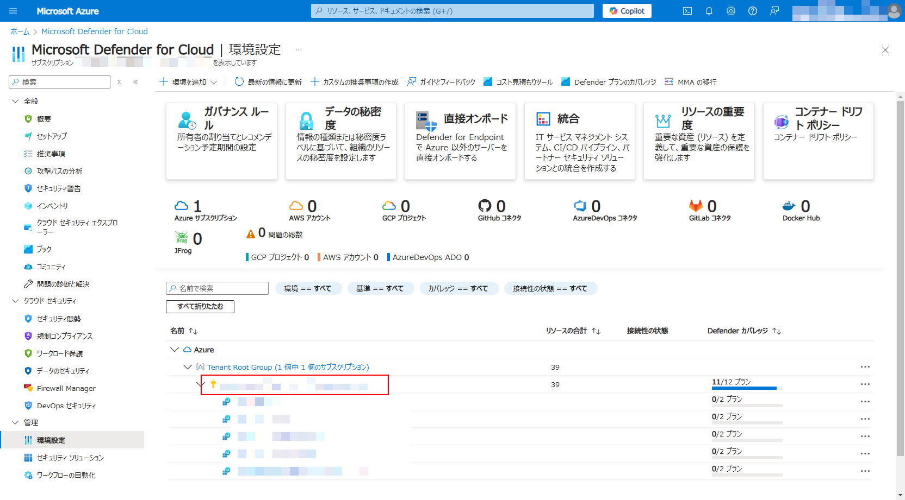

1. Defender CSPM を「オン」にして「保存」

    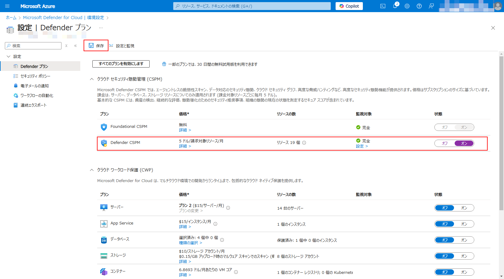


## Defender for Servers の有効化

続いて Defender for Servers を有効化します。
Defender for Servers には複数の機能が含まれるため、包含される機能についても有効化して利用できるようにします。

1. Defender CSPM と同じ画面にて、 CWP の Defender for Servers を「オン」に変更

    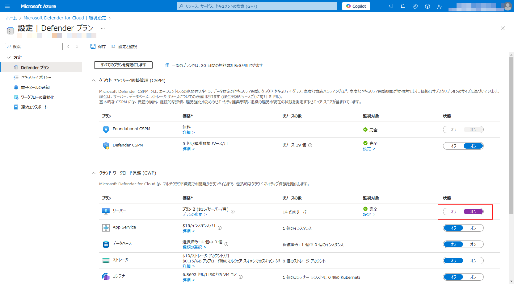

1. プランを P2 に変更

    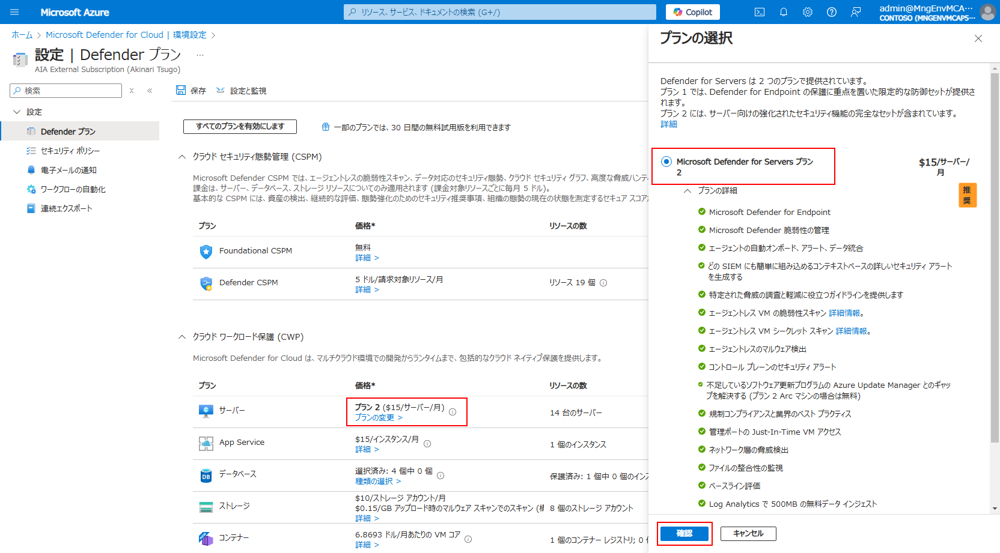

1. 詳細設定を開く

    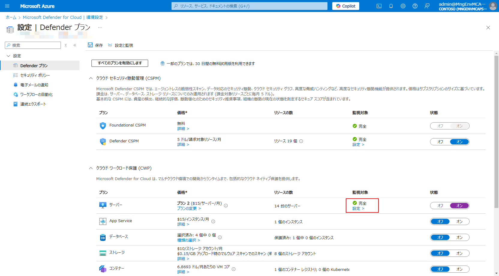

1. 以下の２機能を「オン」にして「続行」

    - マシンの脆弱性評価
    - Endpoint Protection

    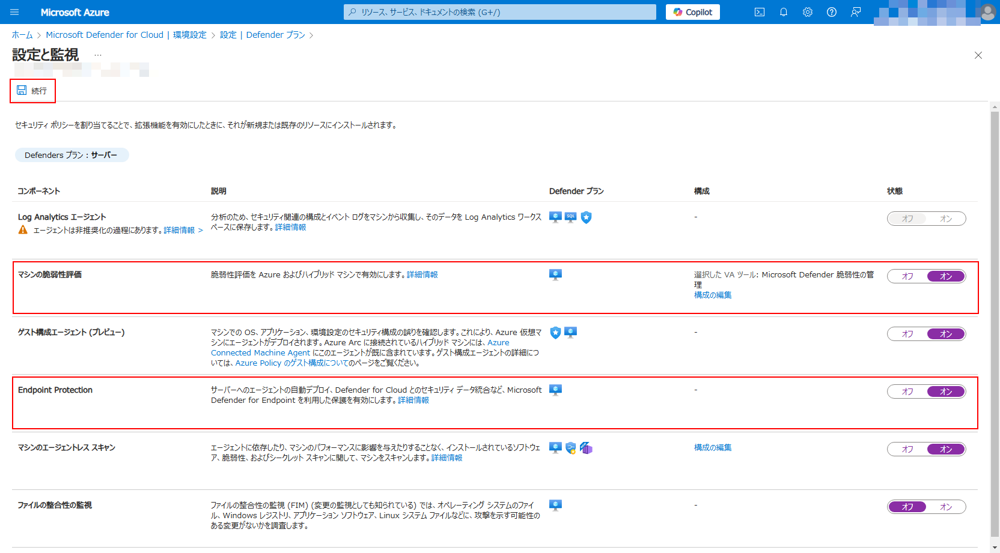

1. 「保存」

    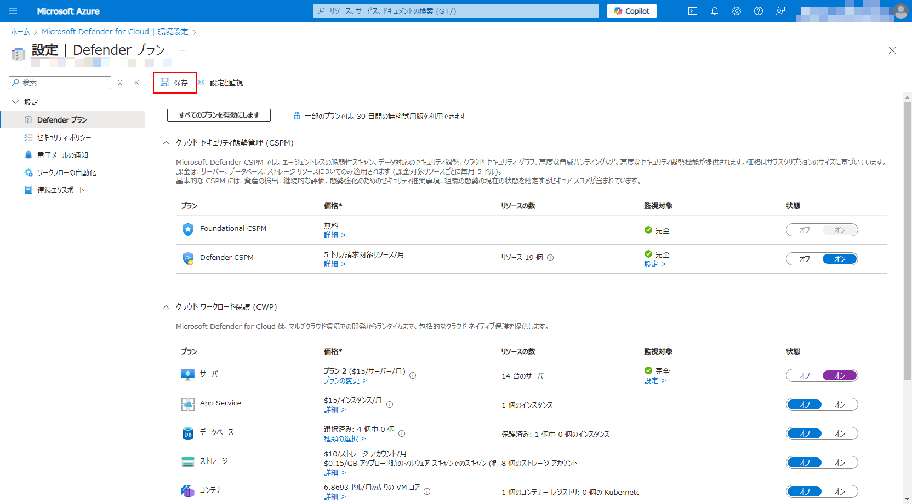


## Defender for Endpoint の展開

> [!IMPORTANT]
> 本手順はハンズオンでは場所の確認だけ行い、実際の確認はスキップします

Defender for Endpoint は自動展開となるため、特に操作は行いません。
最大12時間以上経過後、仮想マシンにエージェントが導入されていることを以下の手順で確認します。

### Defender for Endpoint の適用（自動）

* 前述の通り自動適用となるため特に操作は不要

### Defender for Endpoint の適用確認

1. Azureポータルを開き、仮想マシンを開く

1. [設定]-[拡張機能とアプリケーション] を開く

    

1. `MDE.Windows` がインストールされていることを確認

    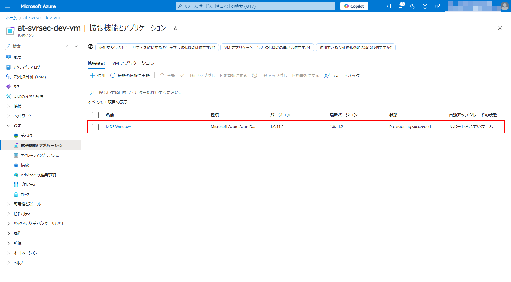


## 脆弱性評価の展開

脆弱性評価も自動展開されますが、こちらの機能は「推奨事項」から強制適用することも可能です。
以下の手順で適用状況の確認および強制適用を行います。

### 脆弱性評価の強制適用

1. Azureポータルを開き、Defender for Cloud を開く

1. [全般]-[推奨事項] を開く

    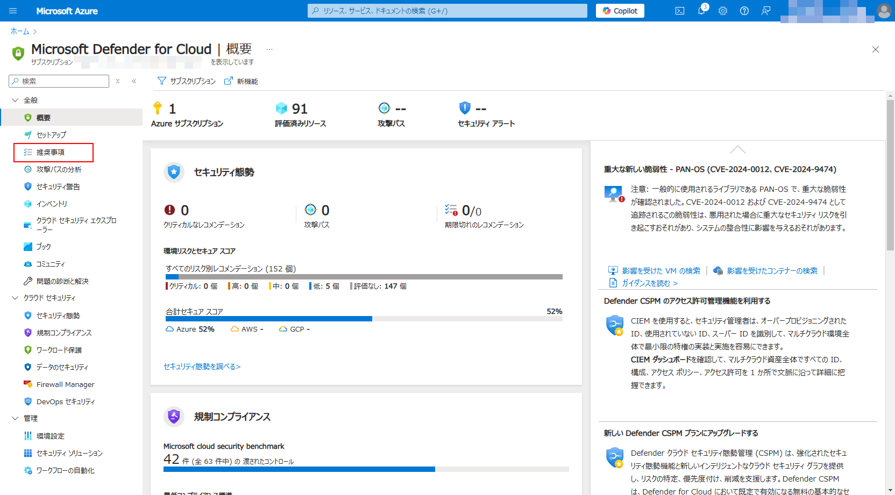

1. 「タイトルでグループ化」し、「マシンには脆弱性評価ソリューションが必要(Machines should have a vulnerability assessment solution)」を探して選択

    

1. 「影響を受けるリソース」から脆弱性評価を展開したいリソースを選択して「修正」

    

1. `Microsoft Defender 脆弱性の管理` を選択して「続行」、「N個のリソースの修正」を選択

    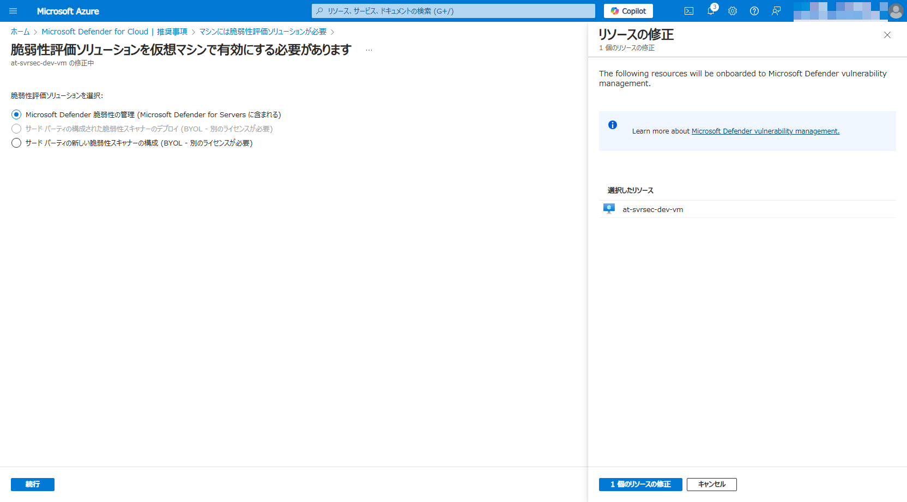

### 脆弱性評価の適用確認

1. Defender for Cloud の推奨事項で「マシンには脆弱性評価ソリューションが必要」を再度開く

    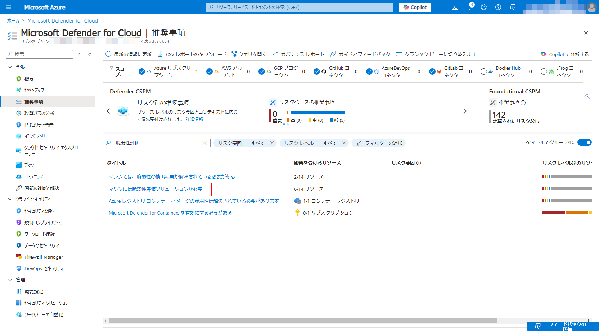

1. 影響を受けるリソース、正常なリソースに設定したリソースがあることを確認

    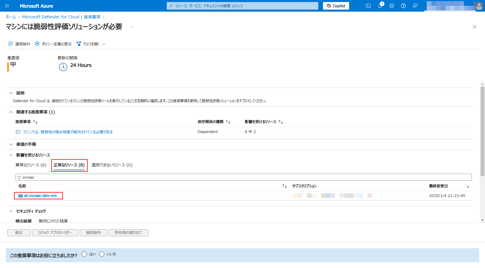


## (参考) Defender for Servers の個別適用

Defender for Servers は個別適用ができる Defender になります。
Defender for Servers の個別適用は「全体適用して一部を除外」か「全体としては適用せず一部だけに適用」のどちらかが利用可能です。
本セクションでは Defender for Servers を個別に適用する手順について学習します。

### Cloud Shell　の起動

1. [Azure ポータル](https://portal.azure.com/) を開く

1. Cloud Shell を起動

    

1. 必要に応じて以下を操作

    - `Bash` へ切り替え
    - ハンズオンで利用するサブスクリプションに切り替え

        ```
        az account set --subscription <YOUR_SUBSCRIPTION_ID>
        ```

### 個別適用機能の有効化

1. 環境変数を準備

    ```
    SUBSCRIPTION=<YOUR_SUBSCRIPTION_ID>
    SCOPE_SUBSC=subscriptions/$SUBSCRIPTION
    ```

1. 現状のサブスクリプション設定を確認

    ```
    az rest --url https://management.azure.com/$SCOPE_SUBSC/providers/Microsoft.Security/pricings/VirtualMachines?api-version=2024-01-01 
    ```

    `properties.pricingTier` や `properties.subPlan` を確認します。
    無効の場合は `"pricingTier": "Free"` 、有効の場合は `"pricingTier": "Standard"` の設定が返ってきます。

    - <details>
        <summary>Defender for Servers が無効の応答例: </summary>

        ```
        {
            "id": "/subscriptions/xxxxxxxx-xxxx-xxxx-xxxx-xxxxxxxxxxxx/providers/Microsoft.Security/pricings/VirtualMachines",
            "name": "VirtualMachines",
            "properties": {
                "freeTrialRemainingTime": "PT0S",
                "pricingTier": "Free",
                "resourcesCoverageStatus": "NotCovered"
            },
            "type": "Microsoft.Security/pricings"
        }
        ```

        </details>

    - <details>
        <summary>Defender for Servers が有効の応答例:</summary>

        ```
        {
            "id": "/subscriptions/xxxxxxxx-xxxx-xxxx-xxxx-xxxxxxxxxxxx/providers/Microsoft.Security/pricings/VirtualMachines",
            "name": "VirtualMachines",
            "properties": {
                "enablementTime": "2025-01-04T00:05:39.7654082Z",
                ... (省略) ...
                "freeTrialRemainingTime": "PT0S",
                "pricingTier": "Standard",
                "resourcesCoverageStatus": "FullyCovered",
                "subPlan": "P2"
            },
            "type": "Microsoft.Security/pricings"
        }
        ```

        </details>

1. 以下のコマンドを実行して、個別適用の機能を有効化（ `enforce: False`  を指定で個別適用機能を有効化 ）

    ```
    az rest --method put \
        --url https://management.azure.com/$SCOPE_SUBSC/providers/Microsoft.Security/pricings/VirtualMachines?api-version=2024-01-01 \
        --body "{'properties':{'pricingTier':'Free','enforce':'False'}}" \
        --verbose
    ```

    応答メッセージにおいて `properties.enforce: False` を確認

### 個別リソースに Defender for Servers を適用

1. 環境変数を準備

    ```
    SUBSCRIPTION=<YOUR_SUBSCRIPTION_ID>
    RESOURCE_GROUP=<YOUR_RESOURCEGROUP_NAME>
    RESOURCE_PROVIDER=Microsoft.Compute 
    RESOURCE_TYPE=virtualMachines 
    RESOURCE_NAME=<YOUR_VM_NAME>
    SCOPE_RSCNM=subscriptions/$SUBSCRIPTION/resourceGroups/$RESOURCE_GROUP/providers/$RESOURCE_PROVIDER/$RESOURCE_TYPE/$RESOURCE_NAME
    ```

1. 現状のリソース設定を確認

    ```
    az rest --url https://management.azure.com/$SCOPE_RSCNM/providers/Microsoft.Security/pricings/VirtualMachines?api-version=2024-01-01 
    ```

    `properties.pricingTier` や `properties.subPlan` を確認します。
    無効の場合は `"pricingTier": "Free"` 、有効の場合は `"pricingTier": "Standard"` の設定が返ってきます。

1. 個別リソースに対して Defender for Servers P1 を適用

    ```
    az rest --method put \
        --url https://management.azure.com/$SCOPE_RSCNM/providers/Microsoft.Security/pricings/VirtualMachines?api-version=2024-01-01 \
        --body "{'properties':{'pricingTier':'Standard','subPlan':'P1'}}" \
        --verbose 
    ```

