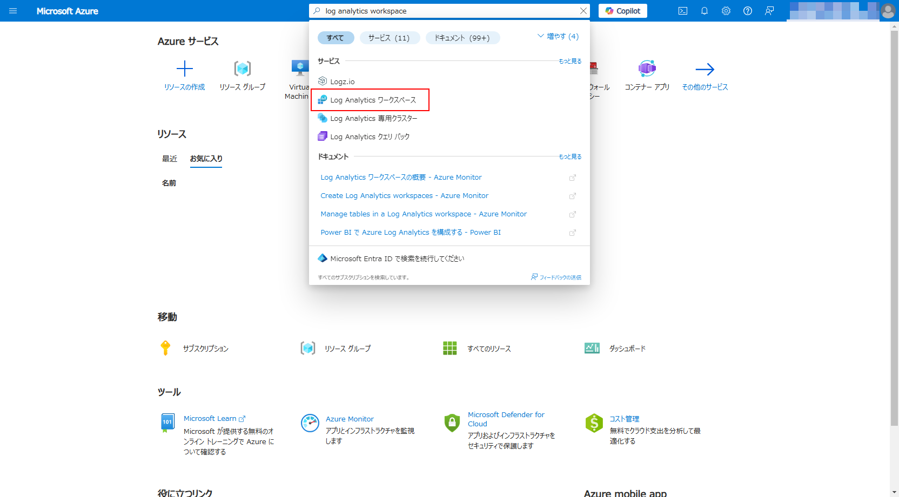
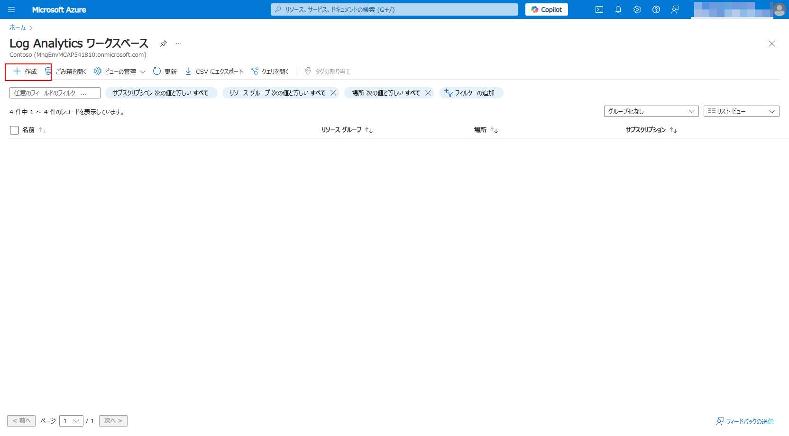
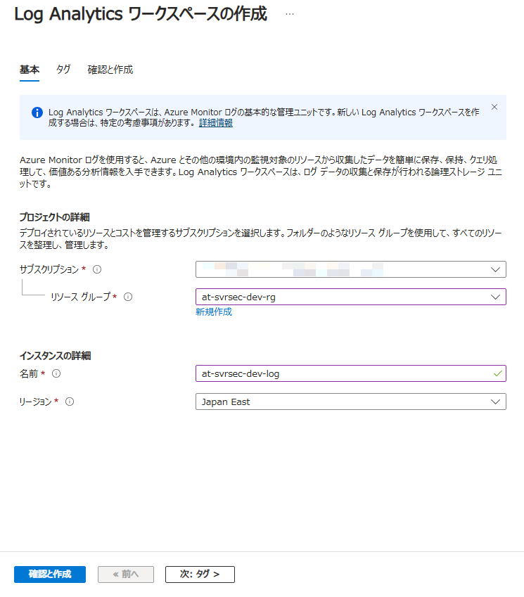
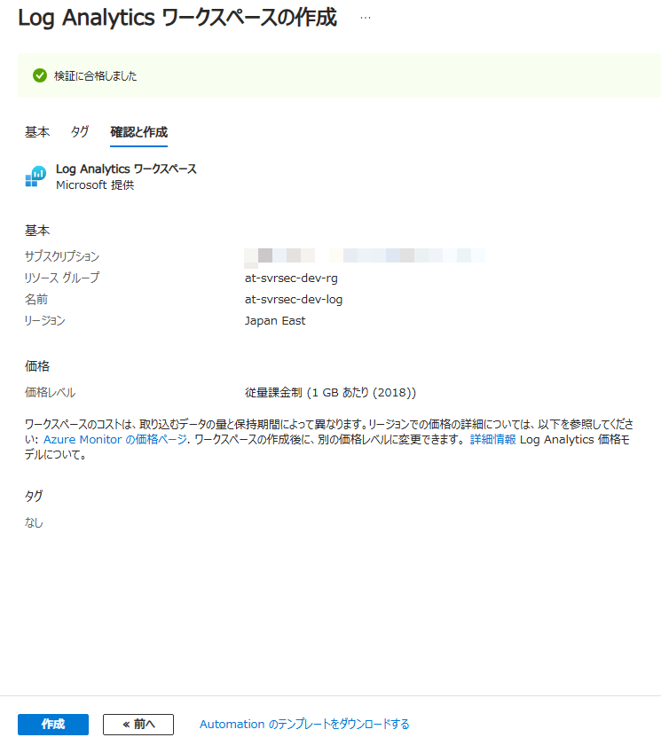
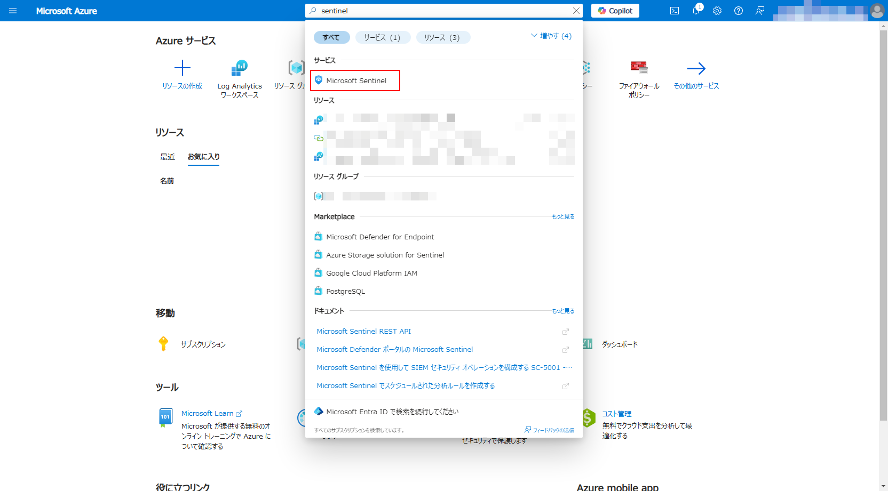
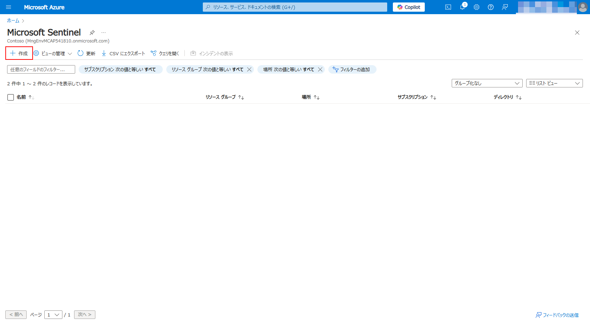
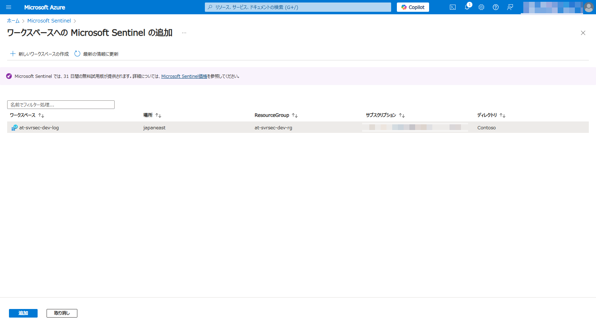

# Ex01: Microsoft Sentinel 利用環境の準備

#### ⏳ 推定時間: 15分

#### 💡 学習概要

Microsoft Sentinel のワークスペースを作成する手順について学習します。

#### 🗒️ 目次

1. [Log Analytics Workspace 作成](#log-analytics-workspace-作成)
1. [Microsoft Sentinel ワークスペース 作成](#microsoft-sentinel-ワークスペース-作成)

## Log Analytics Workspace 作成

1. [Azure ポータル](https://portal.azure.com/) を開く

1. 上部の検索窓を使って Log Analytics Workspace を探して開く

    

1. 左上「作成」を選択

    

1. Log Analytics Workspace を開き、「作成」を選択
    1. 基本

        - リソースグループ: (任意の名前で新規作成)
        - 名前: (任意)
        - リージョン: (任意)
    
        

    1. タグ

        デフォルトまま（設定なし）

    1. 確認と作成

        「作成」を選択

        

## Microsoft Sentinel ワークスペース 作成

1. Azure ポータルを開き、上部検索窓から Sentinel を検索して開く

    

1. 左上「作成」を選択

    

1. 作成済のワークスペースを選択して「追加」

    

