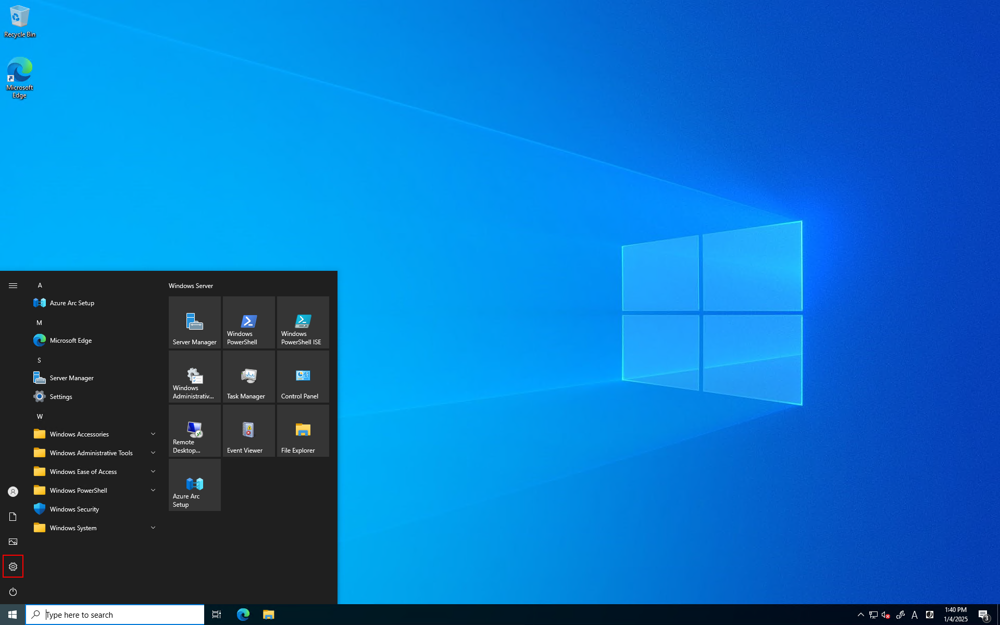
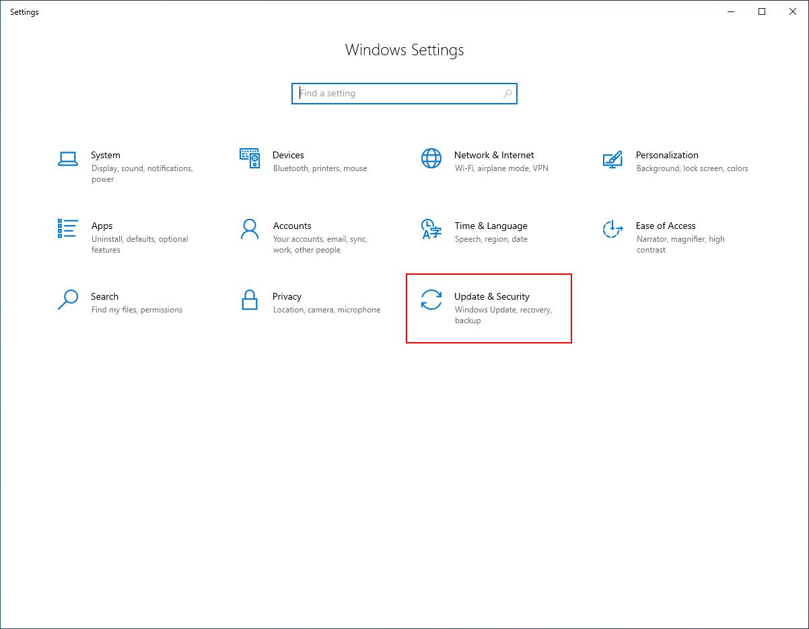
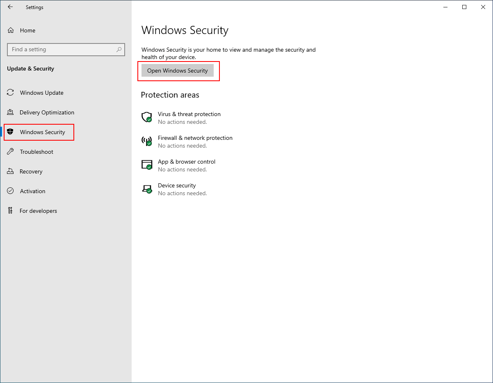
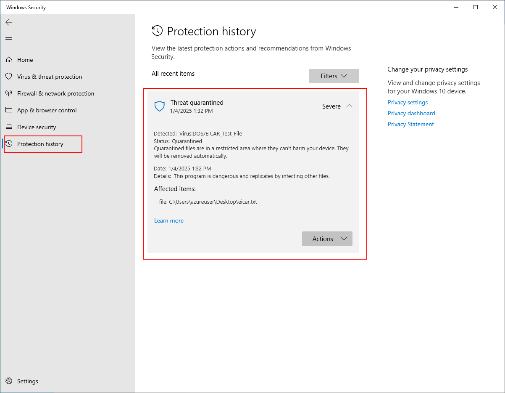
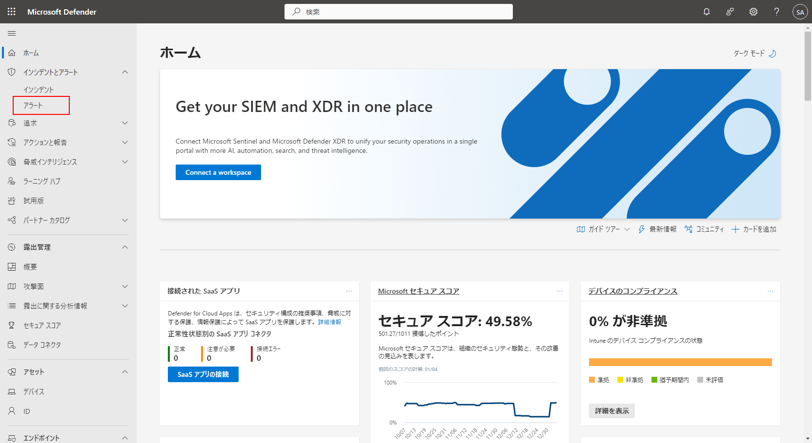
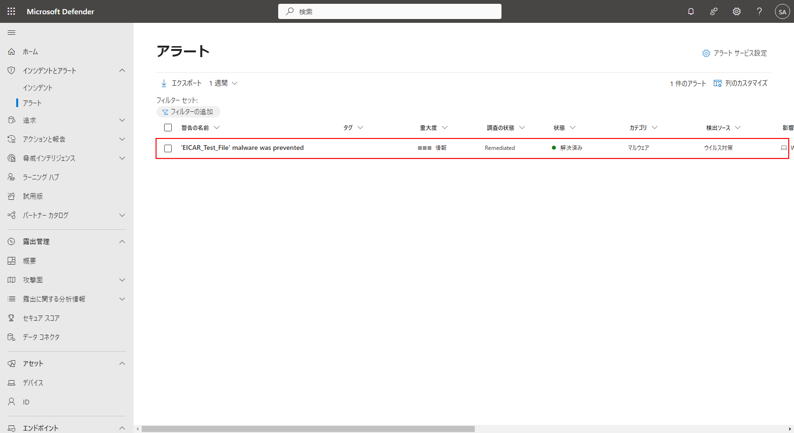

# ExXX: Defender for Cloud の活用

#### ⏳ 推定時間: 15分

#### 💡 学習概要

Defender for Cloud に含まれる機能を有効化し、活用していく方法を学習します。

#### 🗒️ 目次

Defender for Servers
1. マルウェアの検出と隔離
1. 脆弱性の検出と修正

Defender CSPM
1. 攻撃パス分析


## マルウェアの検出と隔離

マルウェア検出のテストでよく利用される EICARテストファイル を準備し、
マルウェアが検出および自動隔離されることを確認します。

### 前提確認

- Defender for Endpoint (拡張機能に `MDE.Windows` ) が導入されていること

### 動作確認

#### 検証用テストデータ作成

1. 検証したい仮想マシンへ接続

1. EICAR テストファイルを作成

    任意の場所にテキストファイル（ `eicar.txt` ）を作成し、以下のテキストを貼り付けて保存

    `eicar.txt`

    ```
    X5O!P%@AP[4\PZX54(P^)7CC)7}$EICAR-STANDARD-ANTIVIRUS-TEST-FILE!$H+H*
    ```

#### 隔離の確認

1. ファイルを保存してすぐに隔離されたこと（ファイルが消えたこと）を確認

    (*) ファイルを Microsoft へ送信するかの問い合わせが出た場合は「送信しない」を選択

1. Windowsメニュー、「Settings」を開く

    

1. 「Update & Security」を開く

    

1. 「Windows Security」を開き、「Open Windows Security」を開く

    

1. 「Protection history」を開き、EICARファイルが隔離されていることを確認

    


#### アラートの確認

1. Defender管理センターを開く

    https://security.microsoft.com/

1. [ホーム]-[アラート] を開く

    

1. EICARファイルを検知したアラートがあることを確認

    (*) 完了以外を表示しないフィルターがかかっている場合があるので、フィルターがされているようであれば解除して確認

    


## 脆弱性の検出と修正


## 攻撃パス分析


