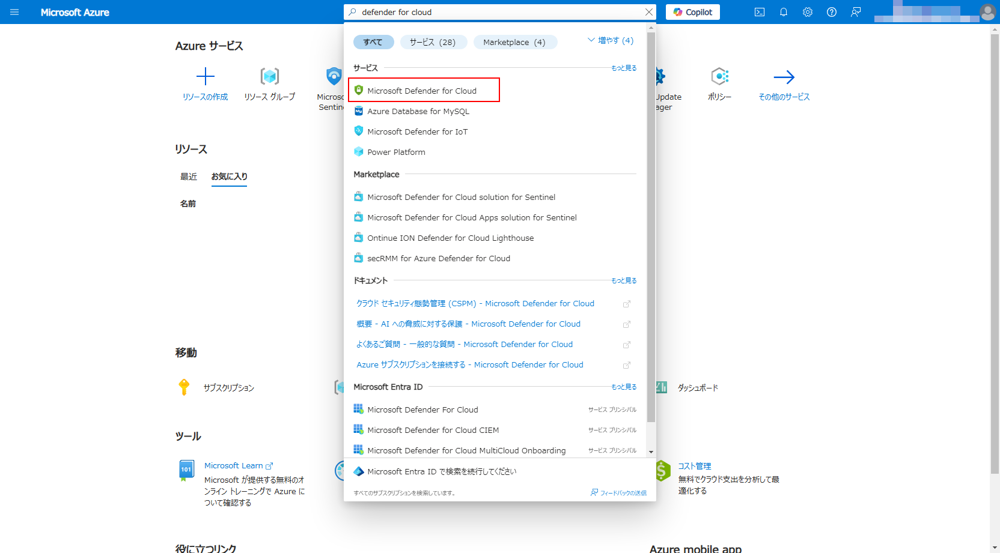
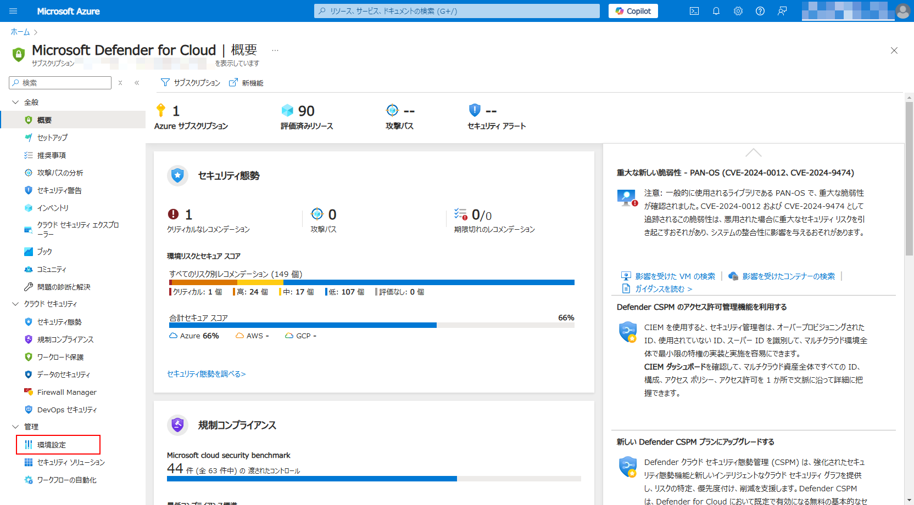
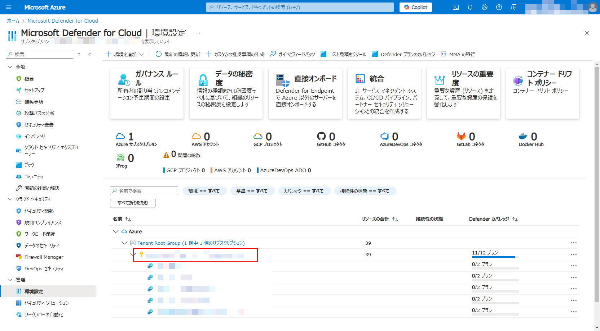
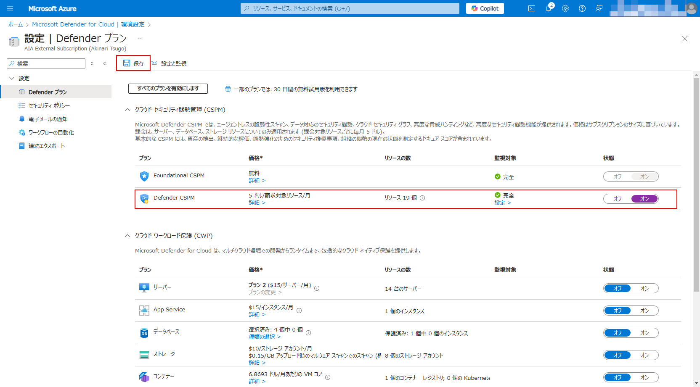

# ExXX: Defender for Cloud の活用

#### ⏳ 推定時間: 15分

#### 💡 学習概要

Defender for Cloud に含まれる機能を有効化し、活用していく方法を学習します。

#### 🗒️ 目次

1. Defender CSPM
1. Defender for Server

## Defender CSPM の有効化

Defender for Cloud は基本的にサブスクリプション単位で有効/無効を切り替えます。
一部の機能ではリソース単位での有効/無効の切り替えをサポートしていますが、機能によって個別適用の方法が異なります。
まずは Defender CSPM を例に基本となるサブスクリプション単位での有効化について学習します。

1. [Azure ポータル](https://portal.azure.com/) を開く

1. 上部の検索窓を使って Defender for Cloud を探して開く

    

1. [管理]-[環境設定] を開く

    

1. 管理グループを展開し、ハンズオンで利用するサブスクリプションを選択

    

1. Defender CSPM を「オン」にして「保存」

    

## Defender for Server の個別適用

1. 