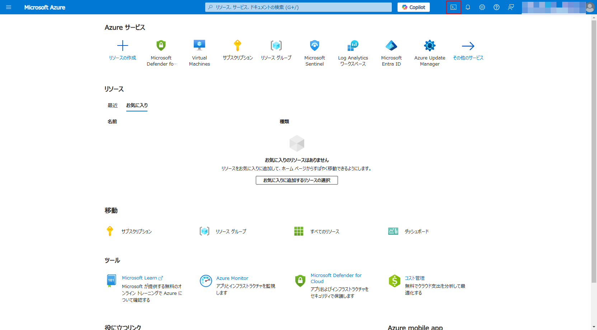

# ExXX: Defender for Cloud の活用

#### ⏳ 推定時間: 15分

#### 💡 学習概要

Defender for Cloud に含まれる機能を有効化し、活用していく方法を学習します。

#### 🗒️ 目次

1. [Defender CSPM の有効化](#defender-cspm-の有効化)
1. [Defender for Server の個別適用](#defender-for-server-の個別適用)


## Defender CSPM の有効化

Defender for Cloud は基本的にサブスクリプション単位で有効/無効を切り替えます。
一部の機能ではリソース単位での有効/無効の切り替えをサポートしていますが、機能によって個別適用の方法が異なります。
まずは Defender CSPM を例に基本となるサブスクリプション単位での有効化について学習します。

1. [Azure ポータル](https://portal.azure.com/) を開く

1. 上部の検索窓を使って Defender for Cloud を探して開く

    

1. [管理]-[環境設定] を開く

    

1. 管理グループを展開し、ハンズオンで利用するサブスクリプションを選択

    

1. Defender CSPM を「オン」にして「保存」

    


## Defender for Server の個別適用

Defender for Server は個別適用ができる Defender になります。
Defender for Server の個別適用は「全体適用して一部を除外」か「全体としては適用せず一部だけに適用」のどちらかが利用可能です。
本セクションでは Defender for Server を個別に適用する手順について学習します。

### Cloud Shell　の起動

1. [Azure ポータル](https://portal.azure.com/) を開く

1. Cloud Shell を起動

    

1. 必要に応じて以下を操作

    - `Bash` へ切り替え
    - ハンズオンで利用するサブスクリプションに切り替え

        ```
        az account set --subscription <YOUR_SUBSCRIPTION_ID>
        ```

### 個別適用機能の有効化

1. 環境変数を準備

    ```
    SUBSCRIPTION=<YOUR_SUBSCRIPTION_ID>
    SCOPE_SUBSC=subscriptions/$SUBSCRIPTION
    ```

1. 現状のサブスクリプション設定を確認

    ```
    az rest --url https://management.azure.com/$SCOPE_SUBSC/providers/Microsoft.Security/pricings/VirtualMachines?api-version=2024-01-01 
    ```

    `properties.pricingTier` や `properties.subPlan` を確認します。
    無効の場合は `"pricingTier": "Free"` 、有効の場合は `"pricingTier": "Standard"` の設定が返ってきます。

    - <details>
        <summary>Defender for Servers が無効の応答例: </summary>

        ```
        {
            "id": "/subscriptions/xxxxxxxx-xxxx-xxxx-xxxx-xxxxxxxxxxxx/providers/Microsoft.Security/pricings/VirtualMachines",
            "name": "VirtualMachines",
            "properties": {
                "freeTrialRemainingTime": "PT0S",
                "pricingTier": "Free",
                "resourcesCoverageStatus": "NotCovered"
            },
            "type": "Microsoft.Security/pricings"
        }
        ```

        </details>

    - <details>
        <summary>Defender for Servers が有効の応答例:</summary>

        ```
        {
            "id": "/subscriptions/xxxxxxxx-xxxx-xxxx-xxxx-xxxxxxxxxxxx/providers/Microsoft.Security/pricings/VirtualMachines",
            "name": "VirtualMachines",
            "properties": {
                "enablementTime": "2025-01-04T00:05:39.7654082Z",
                ... (省略) ...
                "freeTrialRemainingTime": "PT0S",
                "pricingTier": "Standard",
                "resourcesCoverageStatus": "FullyCovered",
                "subPlan": "P2"
            },
            "type": "Microsoft.Security/pricings"
        }
        ```

        </details>

1. 以下のコマンドを実行して、個別適用の機能を有効化（ `enforce: False`  を指定で個別適用機能を有効化 ）

    ```
    az rest --method put \
        --url https://management.azure.com/$SCOPE_SUBSC/providers/Microsoft.Security/pricings/VirtualMachines?api-version=2024-01-01 \
        --body "{'properties':{'pricingTier':'Free','enforce':'False'}}" \
        --verbose
    ```

    応答メッセージにおいて `properties.enforce: False` を確認

### 個別リソースに Defender for Servers を適用

1. 環境変数を準備

    ```
    SUBSCRIPTION=<YOUR_SUBSCRIPTION_ID>
    RESOURCE_GROUP=<YOUR_RESOURCEGROUP_NAME>
    RESOURCE_PROVIDER=Microsoft.Compute 
    RESOURCE_TYPE=virtualMachines 
    RESOURCE_NAME=<YOUR_VM_NAME>
    SCOPE_RSCNM=subscriptions/$SUBSCRIPTION/resourceGroups/$RESOURCE_GROUP/providers/$RESOURCE_PROVIDER/$RESOURCE_TYPE/$RESOURCE_NAME
    ```

1. 現状のリソース設定を確認

    ```
    az rest --url https://management.azure.com/$SCOPE_RSCNM/providers/Microsoft.Security/pricings/VirtualMachines?api-version=2024-01-01 
    ```

    `properties.pricingTier` や `properties.subPlan` を確認します。
    無効の場合は `"pricingTier": "Free"` 、有効の場合は `"pricingTier": "Standard"` の設定が返ってきます。

1. 個別リソースに対して Defender for Server P1 を適用

    ```
    az rest --method put \
        --url https://management.azure.com/$SCOPE_RSCNM/providers/Microsoft.Security/pricings/VirtualMachines?api-version=2024-01-01 \
        --body "{'properties':{'pricingTier':'Standard','subPlan':'P1'}}" \
        --verbose 
    ```