# ExXX: Update Manager を使った更新管理

#### ⏳ 推定時間: 15分

#### 💡 学習概要

Update Manager を用いて サーバー の更新管理を行う方法について学習します。

#### 🗒️ 目次

1. 1回限りの更新の実行
1. スケジュール更新の設定

## 1回限りの更新の実行

1. Azureポータルを開き、 Azure Update Manager を開く

1. [リソース]-[マシン] を開く

   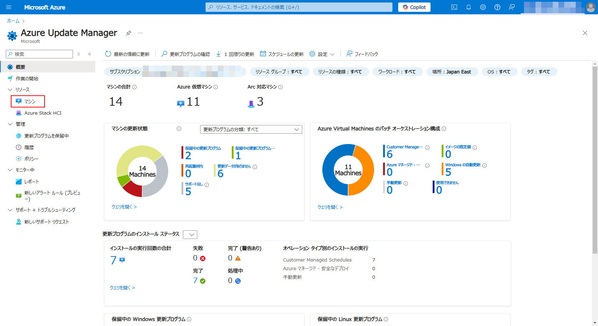

1. 更新したい仮想マシンを選択して、「1回限りの更新」を選択

   ポップアップは 「コンピュータの追加」を選択

   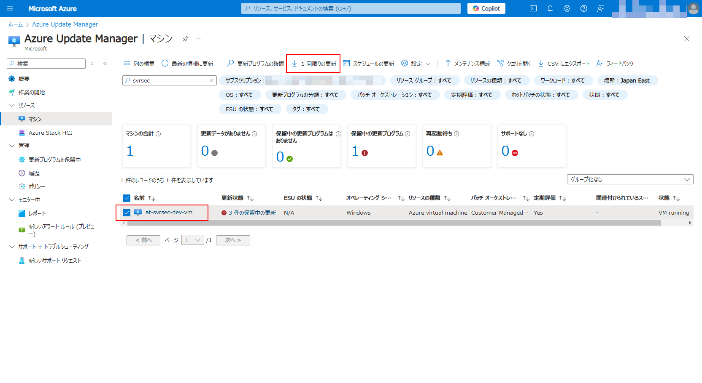

1. 「マシン」タブでは、選択した仮想マシンが追加されていることを確認して、「次へ」

   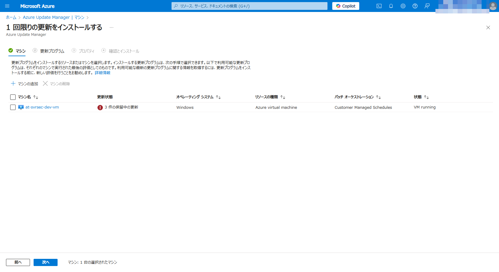

1. 「更新プログラム」タブでは、適用される更新プログラムを確認して、「次へ」

   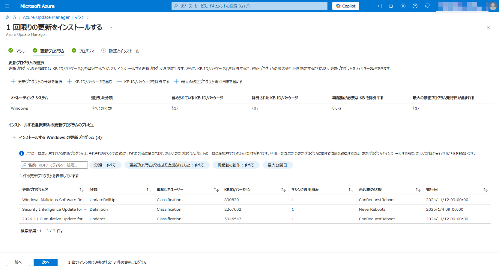

1. 「プロパティ」タブでは、再起動オプションを確認して、「次へ」

   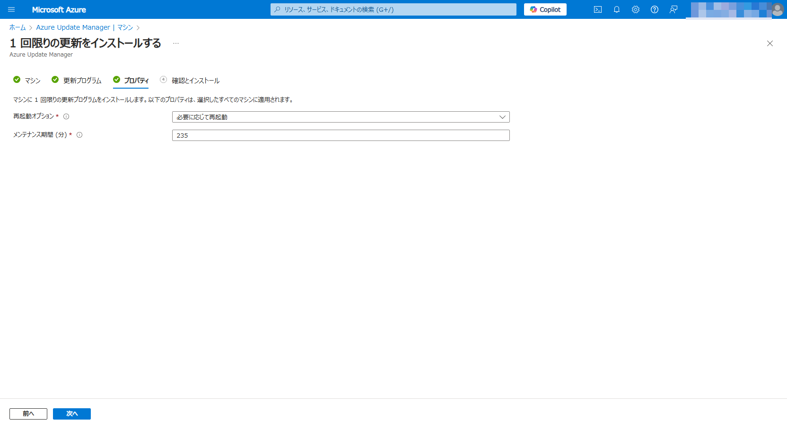

1. 適用内容を確認して「インストール」

   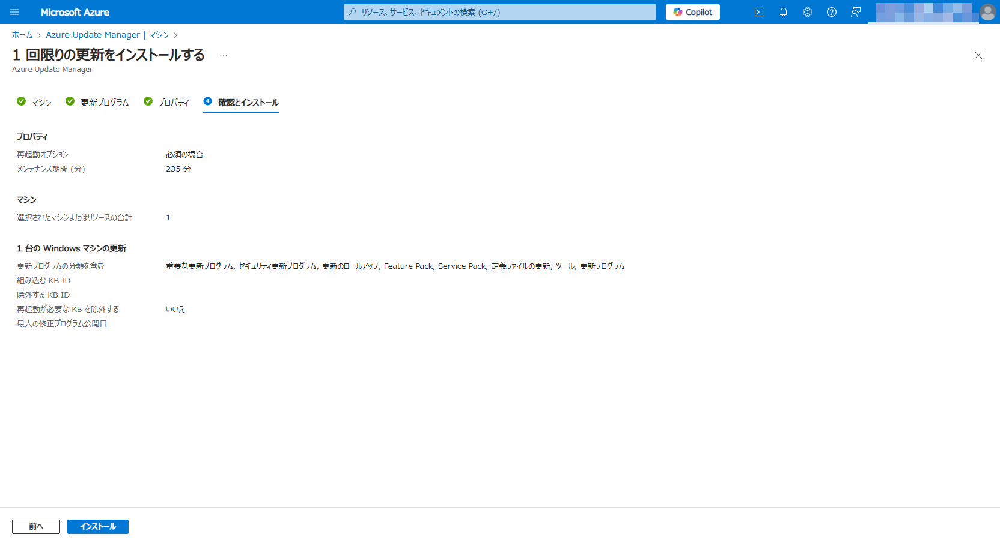

## スケジュール更新の設定

Azureでは、仮想マシンごとに更新をどのように行うのか設定ができます。
まずはスケジュール更新したい仮想マシンに対して、独自ルールによる更新を行うよう設定変更を行います。
その後、具体的なスケジュールを作成、適用していきます。

### 更新方法の構成設定

1. Azureポータルを開き、 Azure Update Manager を開く

1. [リソース]-[マシン] を開く

   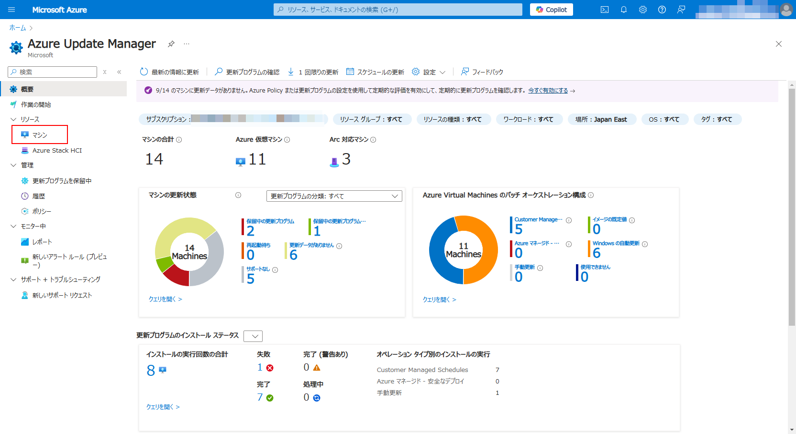

1. 更新方法を変更したい仮想マシンを選択して、[設定]-[設定の更新] を開く

   表示される確認画面では「設定の更新」を選択

   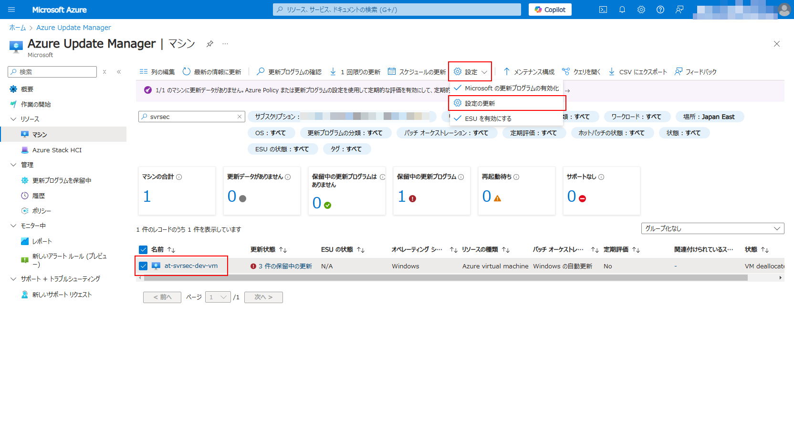

1. 独自スケジュールによる更新が行われるよう、以下の設定を行って「保存」

   - 定期評価: `有効`
   - パッチオーケストレーション: `Customer Managed Schedules`

   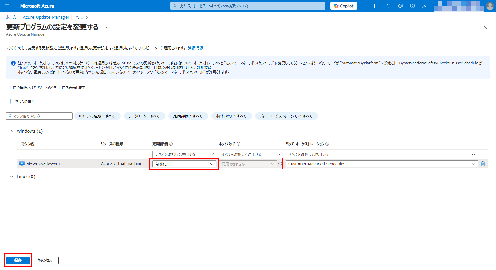

### 更新スケジュールの作成と適用

1. Azureポータルを開き、 Azure Update Manager を開く

1. [リソース]-[マシン] を開く

   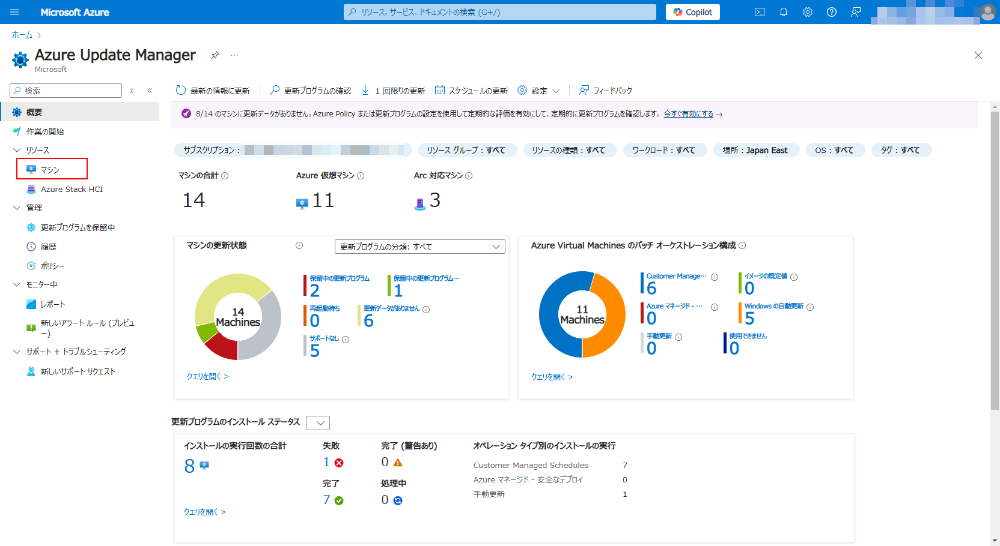

1. 「メンテナンス構成」を開く

   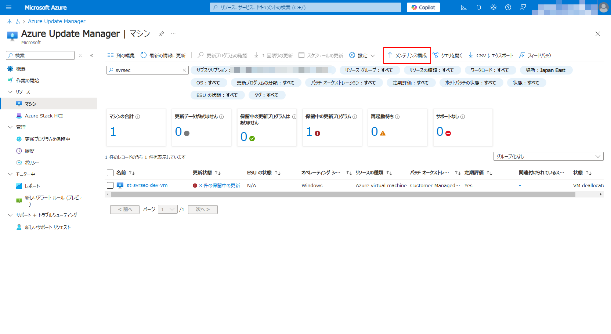

1. 「作成」を選択

   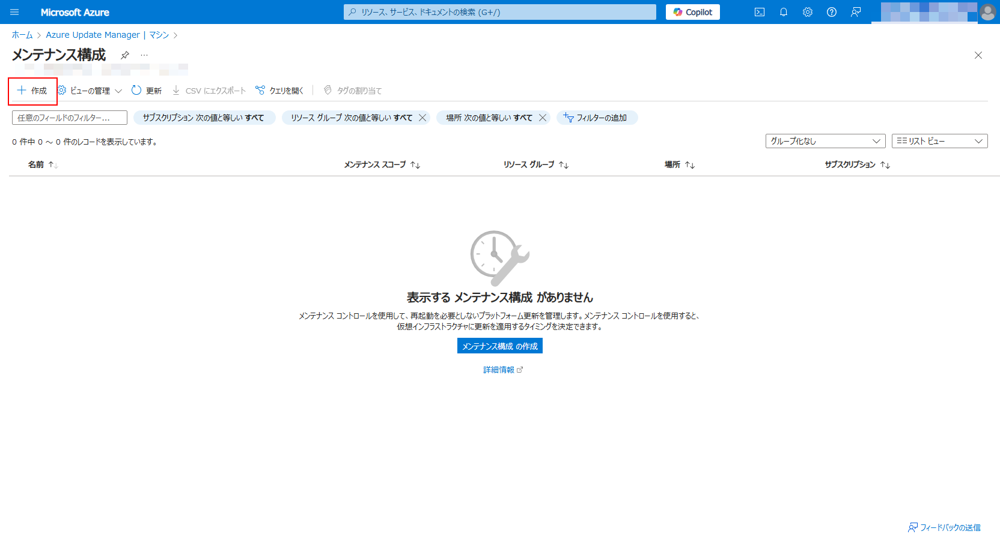

1. メンテナンス構成の作成

   1. 基本

      - サブスクリプション: (ハンズオンで利用するもの)
      - リソースグループ: (ハンズオンで利用するもの)
      - 構成名: (任意)
      - リージョン: (リソースグループにあわせる)
      - メンテナンススコープ: `ゲスト(Azure VM, Arc対応VM/サーバー)`
      - 再起動の設定: `必要に応じて再起動`
      - スケジュールの追加: (`スケジュールの追加リンク` を選択して以下を設定)
         - 開始日: (本日)
         - メンテナス期間: `3時間55分` (デフォルト)
         - 繰り返し: `月1回` `第３土曜日` `オフセット: 0`

      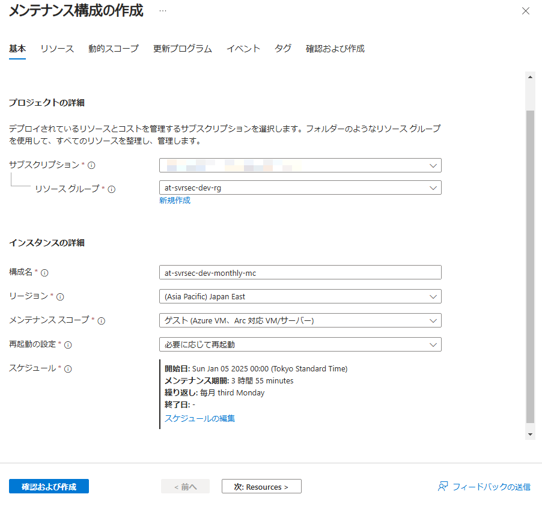

   1. リソース

      ハンズオンで利用している仮想マシンを追加

      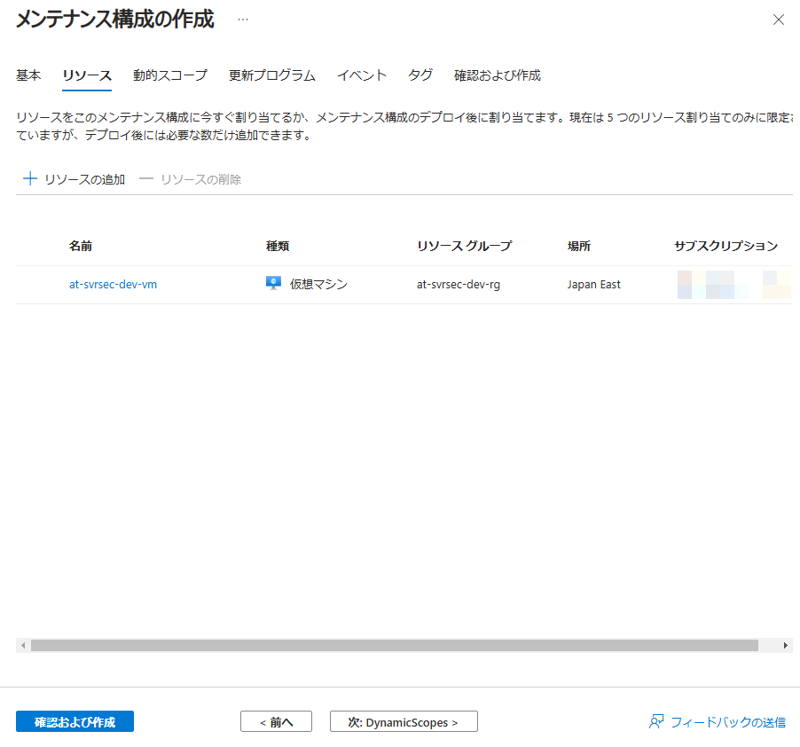

   1. 動的スコープ

      特に指定なし（デフォルトまま）

      「動的スコープを追加」を選択すると、動的に追加するためのフィルタ条件が入力可能。
      リソースグループやリソースの種類、場所、OSの種類、タグなどで対象をフィルタ可能であることを確認。

      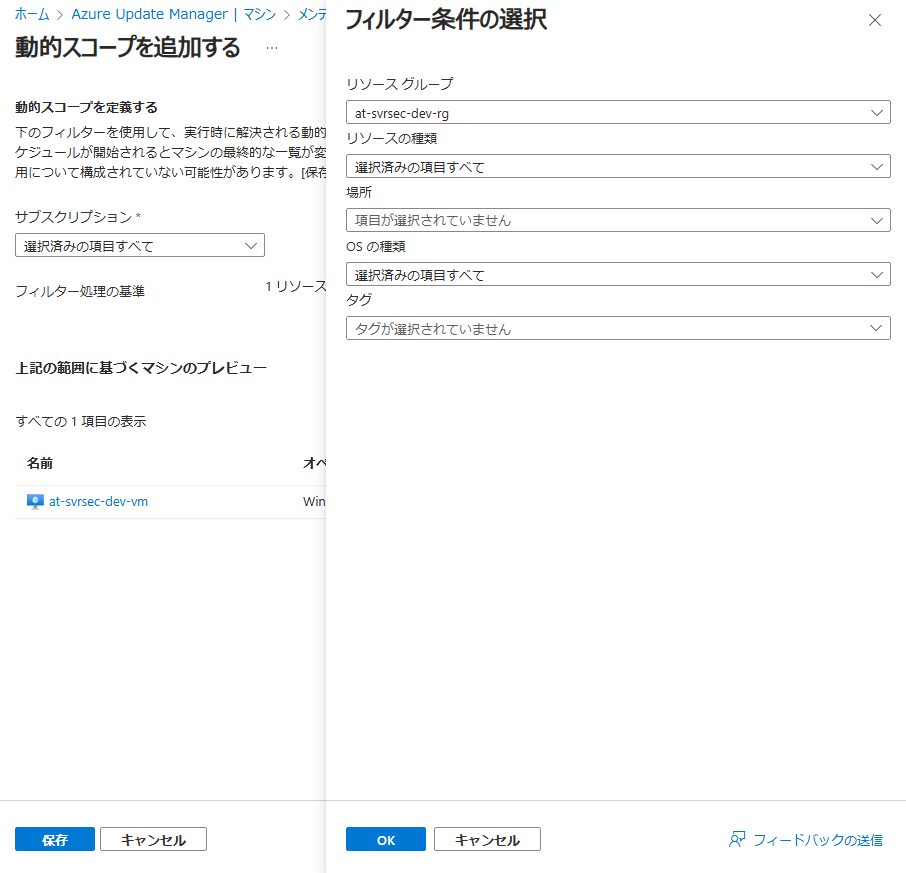

   1. 更新プログラム

      特に指定なし（デフォルトまま）

      「更新プログラムの分類を含める」を選択すると、どのような更新プログラムを適用するのか種類の選択が可能。
      LinuxおよびWindowsでそれぞれどのような更新プログラムの分類が選択できるのかを確認。

      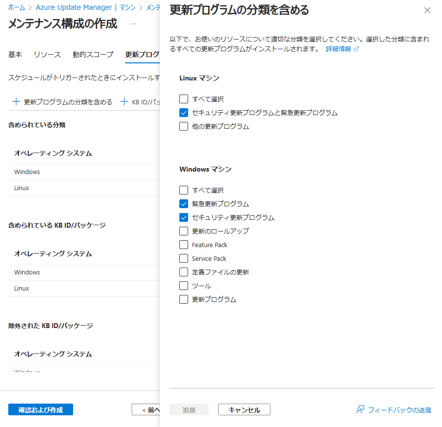

   1. イベント~タグ

      特に指定なし（デフォルトまま）

   1. 確認および作成

      内容を確認して「作成」

      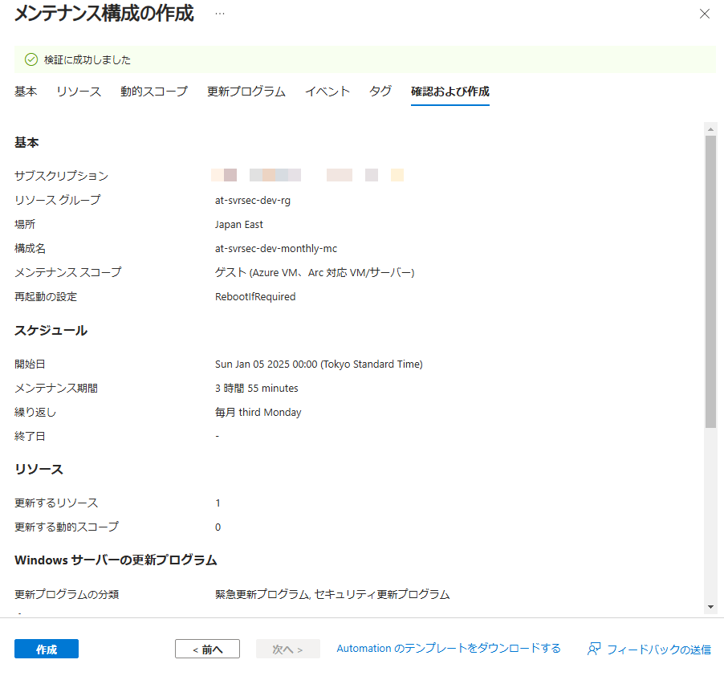

