# ExXX: Microsoft Sentinel へログの集約

#### ⏳ 推定時間: 15分

#### 💡 学習概要

攻撃者は [MITR ATT&CK](https://attack.mitre.org/) に定義されるような戦術や技術を用いて攻撃を行ってきます。
今回はその流れを簡略化した以下のような流れに沿って必要な脅威検出の情報を集約していきます。

1. 特定個人への攻撃
    - 攻撃者は標的とする個人に対してフィッシングやソーシャルエンジニアリングを用いて最初の侵入を試みます。
    - Defender XDR (Defender for Endpoint)
1. 社内情報を捜索
    - 侵入後、攻撃者はアクセス可能なネットワークやファイルを探索し、重要な情報やシステム構造を把握します。
    - Entra ID singin log
1. 管理権限の奪取
    - 次に、攻撃者は権限昇格の技術を用いて、管理者アカウントやシステム全体へのアクセスを取得します。
    - Azure Activity log
1. サーバーへの攻撃
    - 最終的に、攻撃者は主要サーバーに対して攻撃を行い、データの窃取や破壊、ランサムウェアの展開などを実行します。
    - Defender for Cloud

#### 🗒️ 目次

1. 

## Microsoft Defender XDR コネクタの有効化

Microsoft Defender XDR はエンドポイント、ID、メール、アプリケーションを保護し、巧妙な脅威の検出、防止、調査、自動的な対応に役立つ情報を提供します。
本手順では [Microsoft Defender XDR コネクタ](https://learn.microsoft.com/azure/sentinel/data-connectors/microsoft-defender-xdr) を有効化します。

1. Azure ポータルを開き、 Sentinel の ハンズオンで利用するワークスペースを開く

1. [コンテンツ管理]-[コンテンツハブ] を開く

    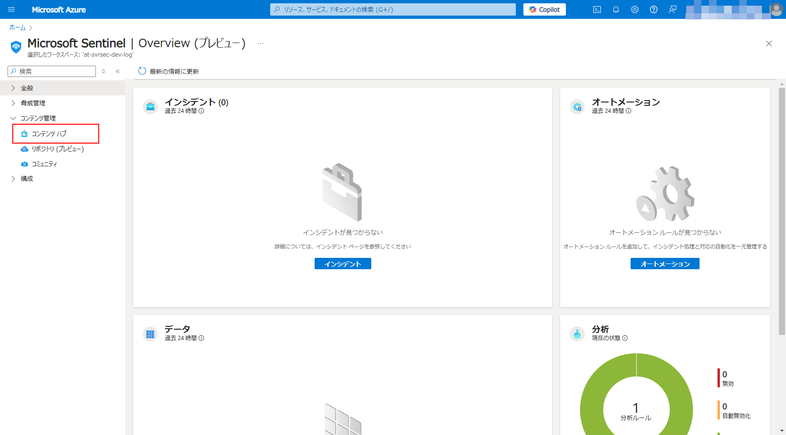

1. `Microsoft Defender XDR` を検索して選択、「インストール」

    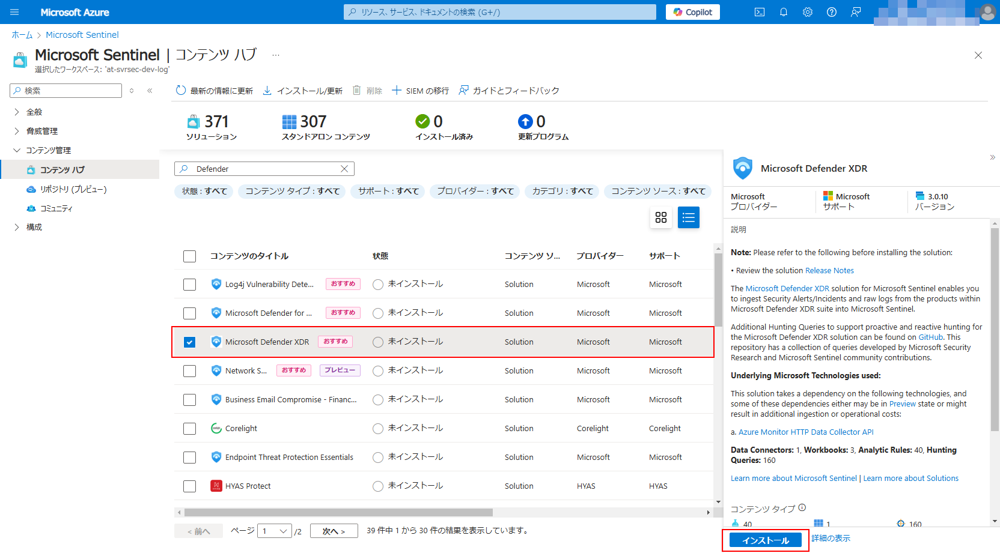

1. インストール後、「管理」を開く

    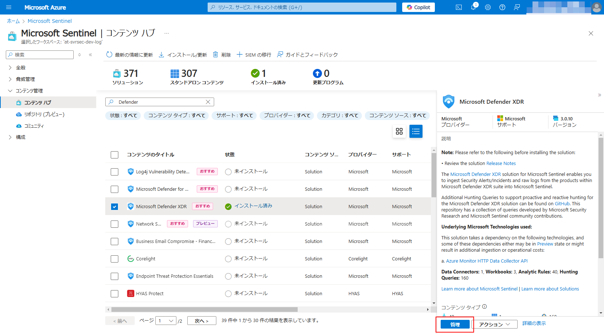

1. `Microsoft Defender XDR` データコネクタ を選択、「コネクタページを開く」を選択

    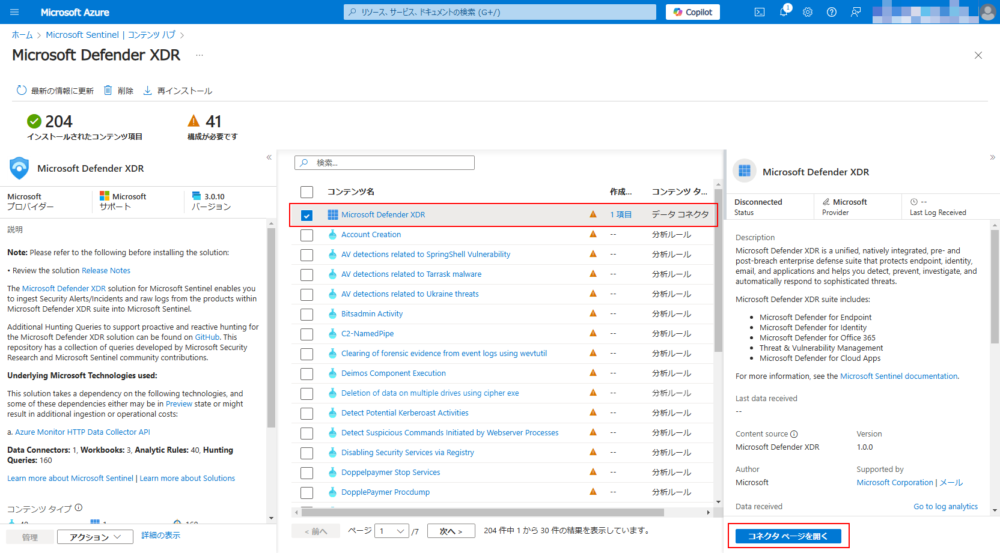

1. 構成にある「インシデントとアラートを接続する」を検索して選択

    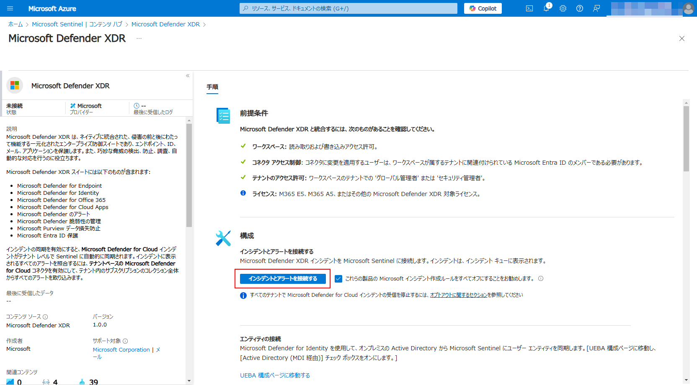

1. 構成にある「イベントの接続」で「Microsoft Defender for Endpoint」をすべて選択して「変更の適用」

    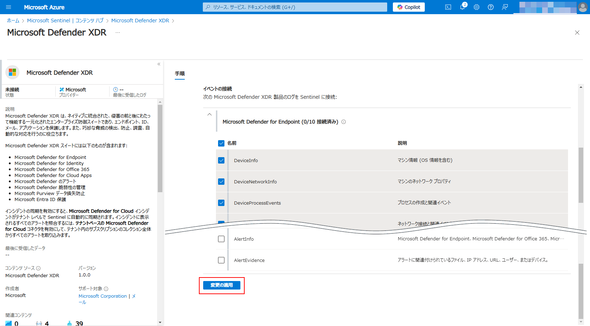

## Microsoft Entra ID コネクタの有効化

監査およびサインインのログを Microsoft Sentinel に接続して、Microsoft Entra ID に関する分析情報を得ます。
本手順では [Microsoft Entra ID コネクタ](https://learn.microsoft.com/azure/sentinel/data-connectors/microsoft-entra-id) を有効化します。

1. Azure ポータルを開き、 Sentinel の ハンズオンで利用するワークスペースを開く

1. [コンテンツ管理]-[コンテンツハブ] を開く

    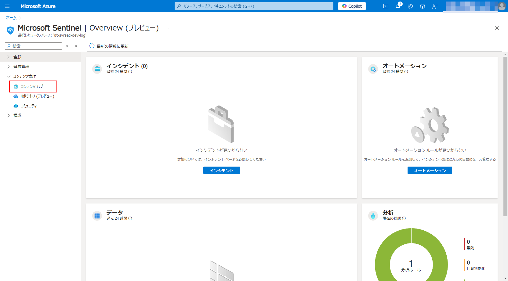

1. `Microsoft Entra ID` を検索して選択、「インストール」

    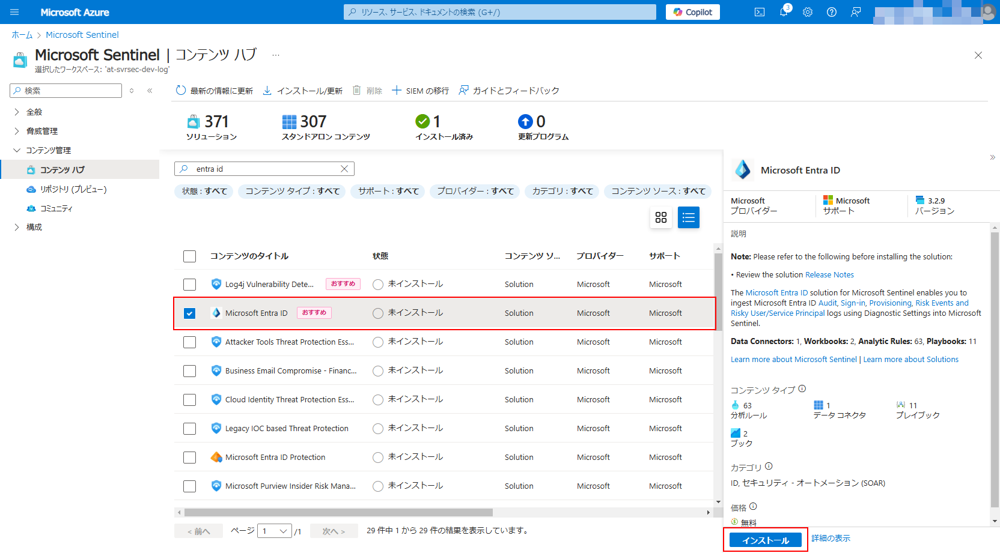

1. インストール後、「管理」を開く

    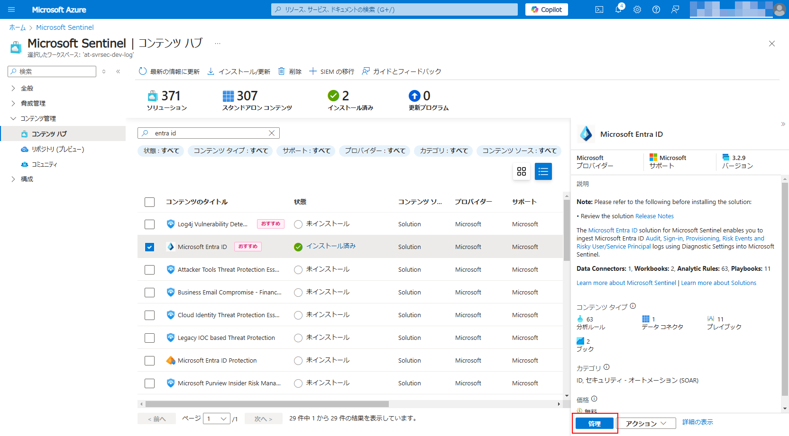

1. `Microsoft Entra ID` のデータコネクタを選択して「コネクタページを開く」を選択

    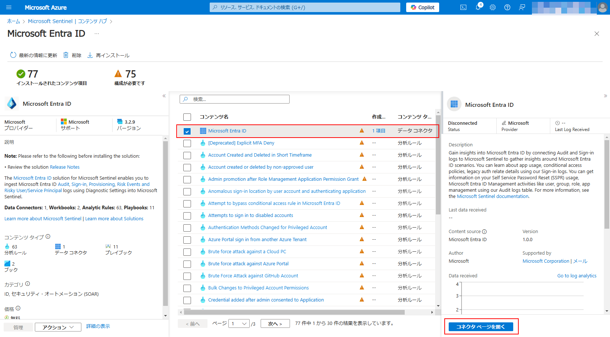

1. 構成から以下のログを選択して「変更の適用」

    - Sign-In Logs
    - 監査ログ
    - Non-Interactive User Sign-In Log
    - Service Principal Sign-In Logs
    - Managed Identity Sign-In Logs
    - Provisioning Logs
    - ADFS Sign-In Logs
    - 危険なユーザー

    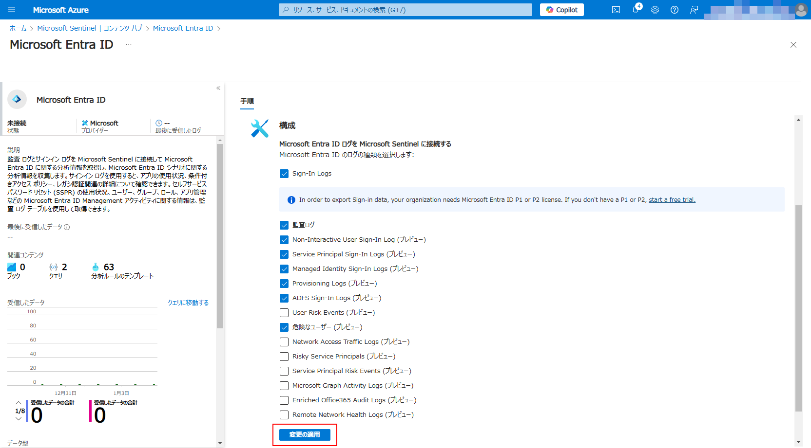

## Azure アクティビティ コネクタの有効化

## Microsoft Defender for Cloud コネクタの有効化

