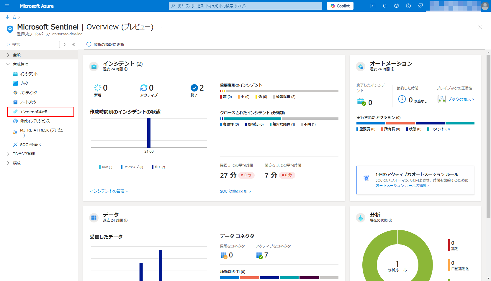
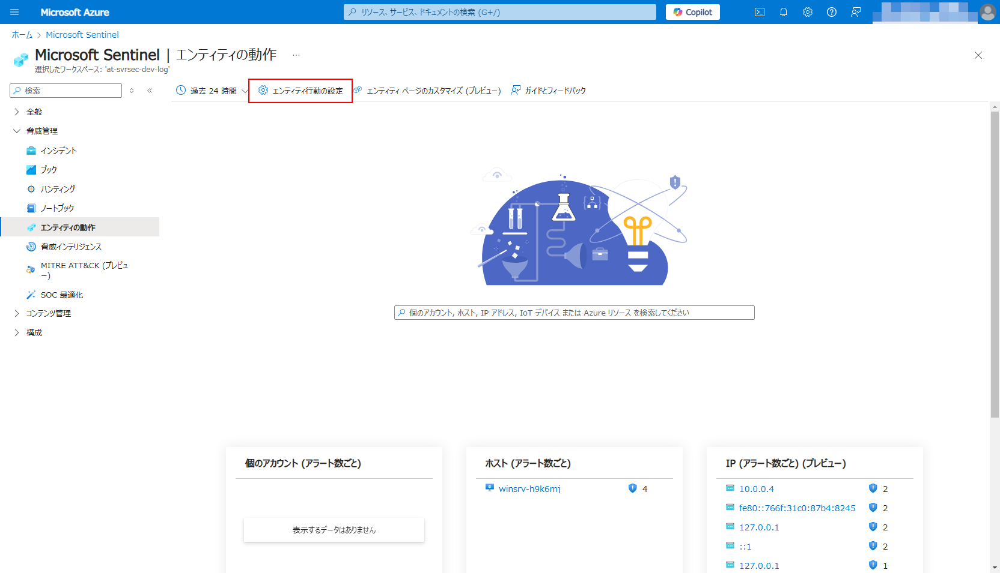
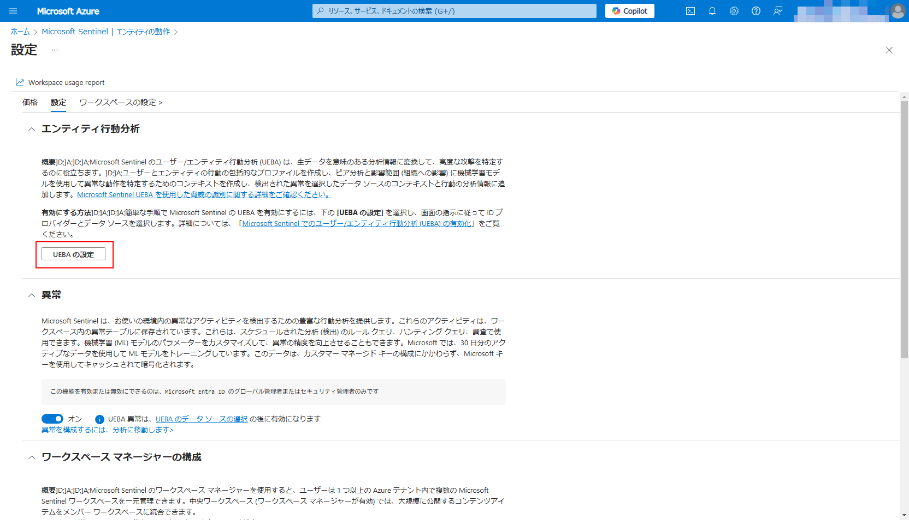
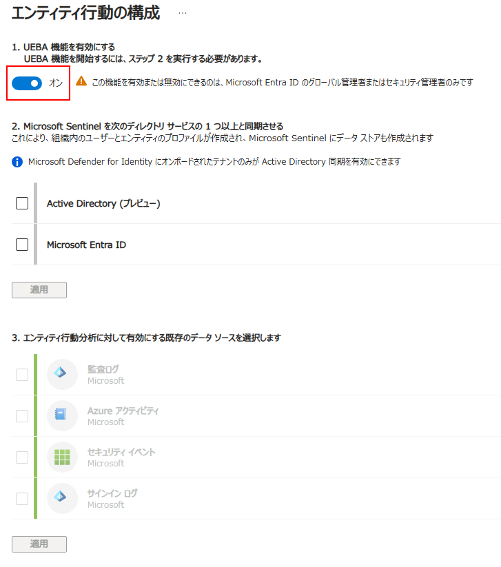
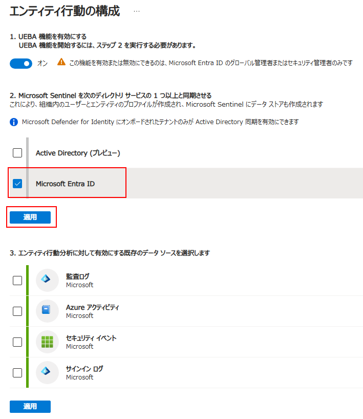
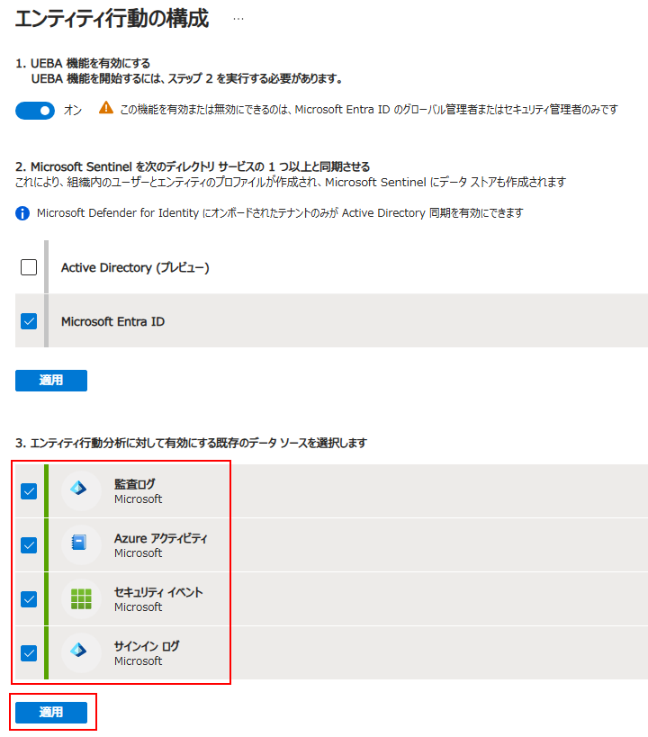

# ExXX: ユーザーとエンティティの行動分析（UEBA）

#### ⏳ 推定時間

- 2 ~ 5分

#### 💡 学習概要

Microsoft Sentinelで利用可能な UEBA機能 を有効化する手順について学習します。

#### 🗒️ 目次

1. [UEBA機能の有効化](#ueba機能の有効化)

## UEBA機能の有効化

Microsoft Sentinel には UEBA機能 が含まれますが、有効化しないと利用できません。
以下の手順では UEBA を有効化して利用できるように設定していきます。

1. Azure ポータルを開き、 Sentinel の ハンズオンで利用するワークスペースを開く

1. [脅威管理]-[エンティティの動作] を開く

    

1. 上部メニューの「エンティティ行動の設定」を開く

    

1. 「エンティティ行動分析」にある「UEBAの設定」を開く

    

1. エンティティ行動の構成

    1. UEBA機能を有効化する

        トグルを「オン」に変更

        

    1. Microsoft Sentinel を次のディレクトリサービスの1つ以上と同期させる

        `Microsoft Entra ID` を選択して「適用」

        

    1. エンティティ行動分析に対して有効にする既存のデータ ソースを選択します

        すべて選択して「適用」

        

