# ExXX: Microsoft Sentinel を使った インシデント対応

#### ⏳ 推定時間: 15分

#### 💡 学習概要


#### 🗒️ 目次

1. マルウェアの検知と対応
1. 不正アクセスの検知と対応


## マルウェアの検知と対応

Defender for Endpoint に関するインシデントは統合されているため、特に設定をしなくても Sentinel のインシデントに出てきます。
本手順ではサーバー上でインシデントテスト用のデータを作成した後、Sentinel でインシデントを確認、調査、対応していく一連の流れを学習します。

#### 検証用テストデータ作成

1. 検証したい仮想マシンへ接続

1. EICAR テストファイルを作成

    任意の場所にテキストファイル（ `eicar.txt` ）を作成し、以下のテキストを貼り付けて保存

    `eicar.txt`

    ```
    X5O!P%@AP[4\PZX54(P^)7CC)7}$EICAR-STANDARD-ANTIVIRUS-TEST-FILE!$H+H*
    ```

1. 自動的に検疫されたことを確認

#### インシデントを確認

1. Azureポータルを開き、 Microsoft Sentinel を開く

1. [脅威管理]-[インシデント] を開く

    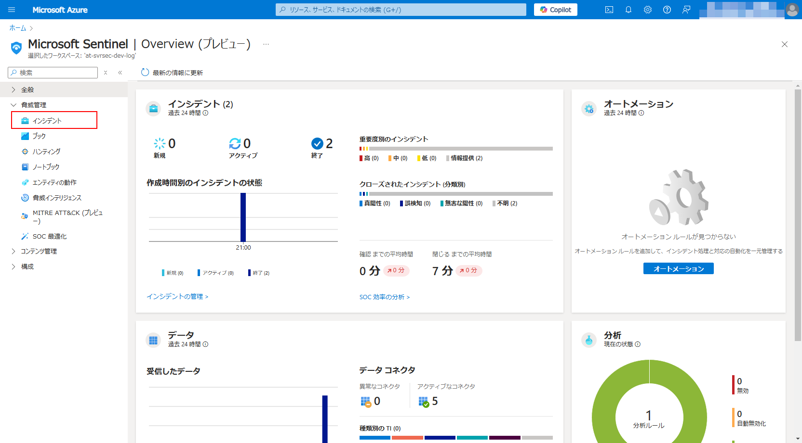

1. インシデント `'EICAR_Test_File' malware was prevented on one endpoint` を選択、概要を確認

    (*) 状態=完了がフィルターされて表示されていない場合があります。
        見つからない場合、状態フィルターに完了を追加して再度確認します。

    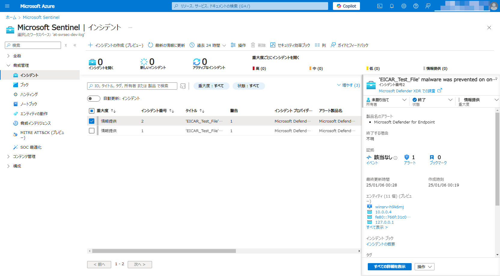


#### インシデントのアサインと調査

1. インシデントの担当に `自分への割り当て` を設定

    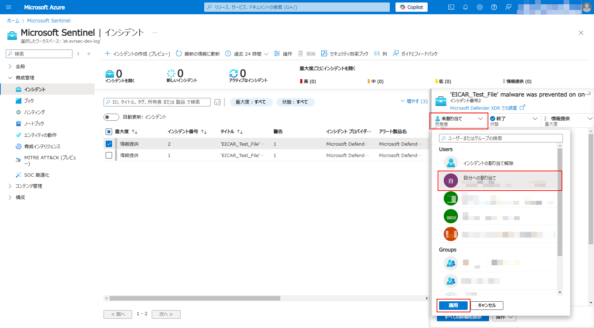

1. インシデントの状態を `アクティブ` に設定

    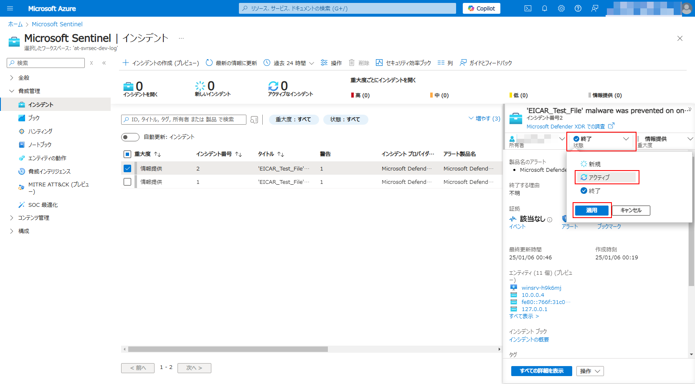

1. 「すべての詳細を表示」を開く

    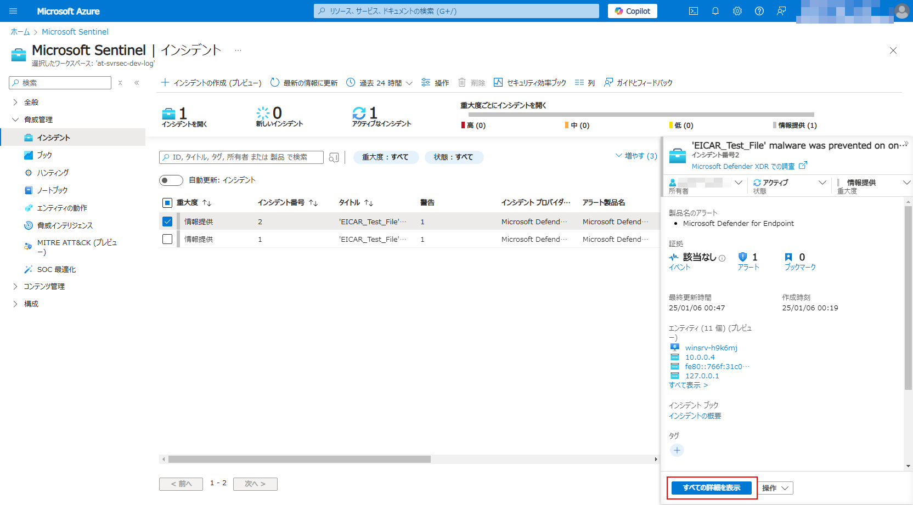

1. 「概要」の「エンティティ」を確認

    検知されたマルウェアのファイル名 ( ファイル ) 
    および、検知された端末 ( ホスト ) を確認

    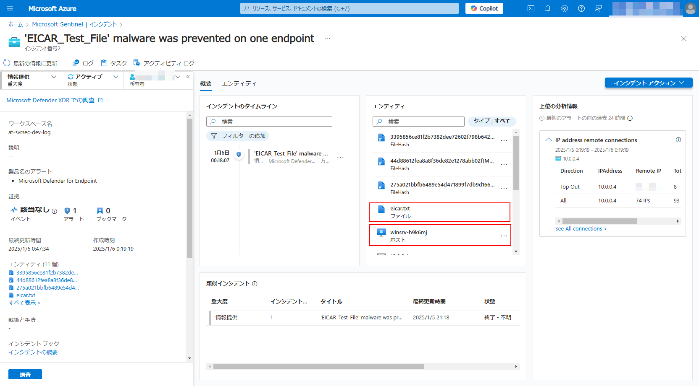

1. 「概要」の「エンティティ」にあるホストを選択

    マルウェア検出されたホストの詳細情報を確認

    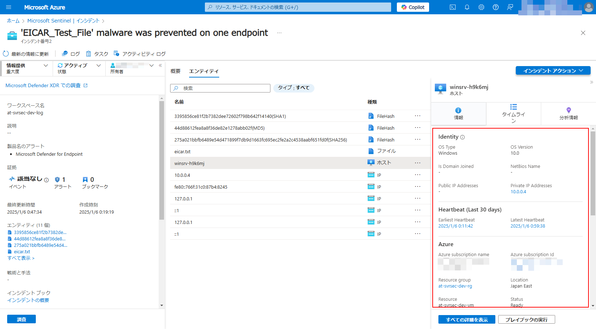


#### オートメーションルールの作成

1. 「インシデントアクション」を開き、「オートメーションルールの作成」を選択

    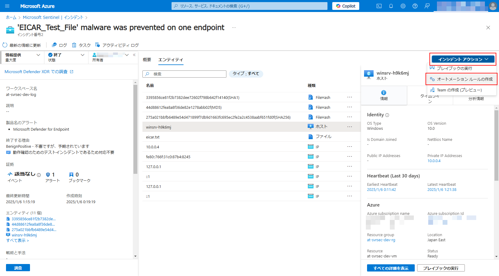

1. オートメーションルールを以下に設定して「適用」

    - オートメーションルール名: `Close expected 'EICAR_Test_File' malware detection`
    - トリガー: `インシデントが作成されたとき`
    - 条件:
        - インシデントプロバイダー: `次と等しい` `すべて`
        - 分析ルール名: `次を含む` `すべて`
        - ホスト名: `次と等しい` (仮想マシン名)
    - 操作:
        - `状態の変更` `終了`
        - `無害な陽性 - 不信ですが、予期されています`
    - ルールの有効期限: (1週間後)
    - 状態: `有効`

    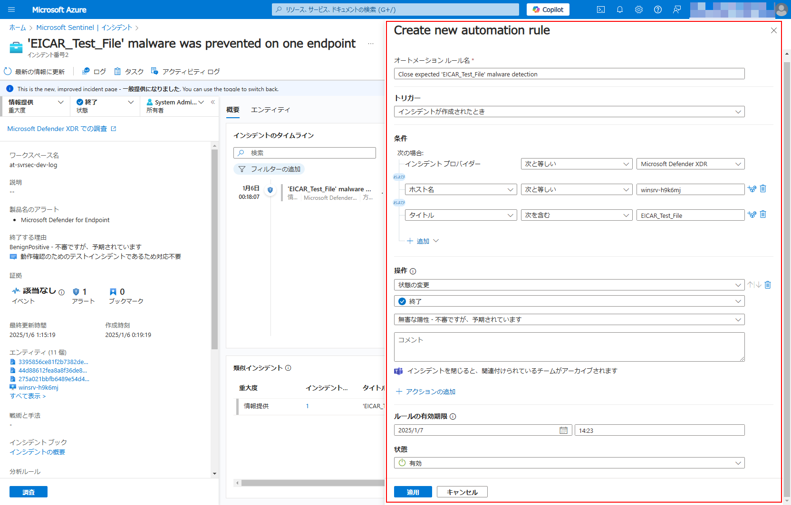


#### 作業コメントを残してクローズ

1. 上部メニューにある「アクティビティログ」を開く

    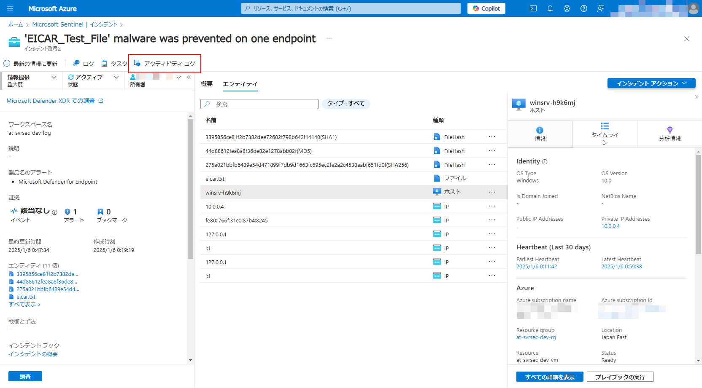

1. 作業内容をコメントに入力して「コメント」

    - `動作確認のためのテストインシデントであるため対応不要`

    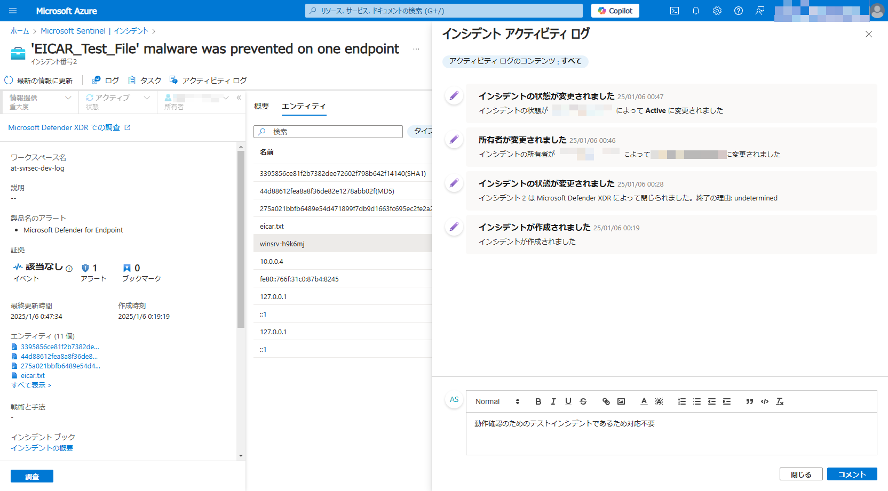

1. 状態を「終了」に変更してクローズ

    - 状態: `終了`
    - `無害な陽性`
    - `動作確認のためのテストインシデントであるため対応不要`

    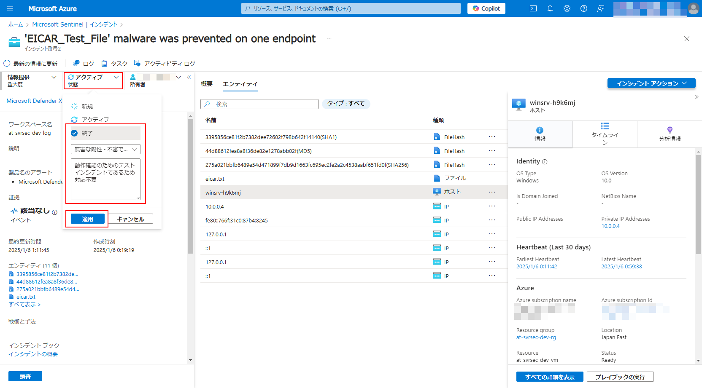


## 不正アクセスの検知と対応

通常、Sentinelにログを収集しただけではインシデントとして上がってきません。
コンテンツハブから登録したソリューションに含まれる「分析ルール」を利用することでインシデントを見つけ出します。
本手順では分析ルールを追加したうえで、テストデータを作成、インシデントの検知～対応を行っていきます。

#### 分析ルールの設定


1. Azureポータルを開き、 Microsoft Sentinel を開く

1. [コンテンツ管理]-[コンテンツハブ] を開く

1. `Microsoft Entra ID` を検索して選択、「管理」を開く

1. 分析ルール `MFA Rejected by User` を検索して選択、「ルールの作成」を選択

1. 分析ルールウィザード

    1. 全般

    1. ルールのロジックを設定

    1. インシデントの設定

    1. 自動応答

    1. 確認と作成

        内容を確認して「作成」


#### 検証用テストデータ作成

1. 任意のブラウザをシークレットモードで起動

1. Azureポータルへアクセス

1. 本ハンズオンで利用しているユーザーでログインを試行

1. **MFAを意図的に拒否**


#### インシデントを確認

1. Azureポータルを開き、 Microsoft Sentinel を開く

1. [脅威管理]-[インシデント] を開く

1. 

#### インシデントのアサインと調査


#### 作業コメントを残してクローズ