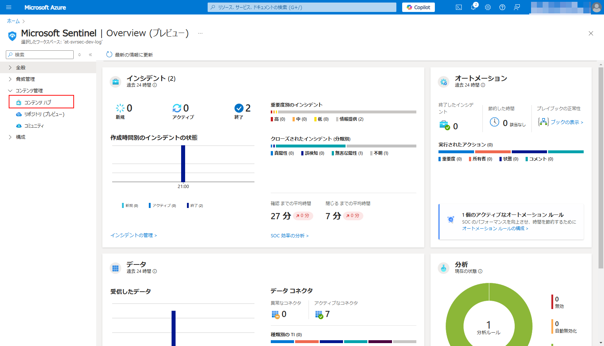

# Ex07: Microsoft Sentinel を使った インシデント対応

#### ⏳ 推定時間

- 30 ~ 45分

#### 💡 学習概要

Microsoft Sentinel に集めたログからインシデントを検出し、調査、対応を行っていく一連の流れを学習します。


#### 🗒️ 目次

1. [マルウェアの検知と対応](#マルウェアの検知と対応)
1. [不正アクセスの検知と対応](#不正アクセスの検知と対応)
1. [MITRE ATT&CK カバレッジの確認](#mitre-attck-カバレッジの確認)

## マルウェアの検知と対応

Defender for Endpoint に関するインシデントは統合されているため、特に設定をしなくても Sentinel のインシデントに出てきます。
本手順ではサーバー上でインシデントテスト用のデータを作成した後、Sentinel でインシデントを確認、調査、対応していく一連の流れを学習します。

#### 検証用テストデータ作成

1. 検証仮想マシンへ接続

1. EICAR テストファイルを作成

    任意の場所にテキストファイル（ `eicar.txt` ）を作成し、以下のテキストを貼り付けて保存

    `eicar.txt`

    ```
    X5O!P%@AP[4\PZX54(P^)7CC)7}$EICAR-STANDARD-ANTIVIRUS-TEST-FILE!$H+H*
    ```

1. 自動的に検疫されたことを確認

> [!NOTE]  
> 反映は 10分 程度かかります。

> [!IMPORTANT]  
> 上記テストデータがうまく反映しない場合(または1日開催の場合)、「Microsoft Sentinel Training Lab」を利用します。
> 1. Azure ポータルを開き、上部検索窓で "Microsoft Sentinel Training Lab" を検索、開く（Sentinel の コンテンツハブ からでも開ける）
> 1. マーケットプレースの「Microsoft Sentinel Training Lab Solution」を「作成」
> 1. 基本： リソースグループ、ワークスペースを指定
> 1. ワークブック： 表示名はデフォルトまま
> 1. 分析： 特に指定なし
> 1. プレイブック： プレイブック名はデフォルトまま
> 1. 「作成」
>
> 反映には 20分 程度かかります。

<!--
> [!IMPORTANT]  
> 上記テストデータがうまく反映しない場合、 Defender for Cloud の「サンプルアラート」を利用します。
> 1. Microsoft Defender for Cloud を開く
> 1. [全般]-[セキュリティ警告] を開く
> 1. 「サンプルのアラート」を選択
> 1. サンプルのアラート作成で、以下を設定して「サンプルアラートの作成」
>     - サブスクリプション: (本ハンズオンで利用しているサブスクリプション)
>     - Defender for Cloud プラン: `仮想マシン`
>
> 反映には 10分 程度かかります。
-->

#### インシデントを確認

1. Azureポータルを開き、 Microsoft Sentinel を開く

1. [脅威管理]-[インシデント] を開く

    

1. インシデント `'EICAR_Test_File' malware was prevented on one endpoint` を選択、概要を確認

    (*) 状態=完了がフィルターされて表示されていない場合があります。
        見つからない場合、状態フィルターに完了を追加して再度確認します。

    
<!-- 
(*) インシデントは即時で連携されないため、反映していない場合、以下の手順で仮のインシデントを作成します。

1. [脅威管理]-[インシデント] の画面にて、 「＋インシデントの作成」を選択

    

1. 以下を入力して「作成」

    - タイトル: `'EICAR_Test_File' malware was prevented on one endpoint`
    - 重大度: `情報提供`

    
-->


#### インシデントのアサインと調査

1. インシデントの担当に `自分への割り当て` を設定

    

1. インシデントの状態を `アクティブ` に設定

    

1. 「すべての詳細を表示」を開く

    

1. 「概要」の「エンティティ」を確認

    検知されたマルウェアのファイル名 ( ファイル ) 
    および、検知された端末 ( ホスト ) を確認

    

1. 「概要」の「エンティティ」にあるホストを選択

    マルウェア検出されたホストの詳細情報を確認

    


#### オートメーションルールの作成

1. 「インシデントアクション」を開き、「オートメーションルールの作成」を選択

    

1. オートメーションルールを以下に設定して「適用」

    - オートメーションルール名: `Close expected 'EICAR_Test_File' malware detection`
    - トリガー: `インシデントが作成されたとき`
    - 条件:
        - インシデントプロバイダー: `次と等しい` `Microsoft Defender XDR`
        - ホスト名: `次と等しい` (仮想マシン名)
        - タイトル: `次を含む` `EICAR_Test_File`
    - 操作:
        - `状態の変更` `終了`
        - `無害な陽性 - 不信ですが、予期されています`
    - ルールの有効期限: (1週間後)
    - 状態: `有効`

    


#### 作業コメントを残してクローズ

1. 上部メニューにある「アクティビティログ」を開く

    

1. 作業内容をコメントに入力して「コメント」

    - `動作確認のためのテストインシデントであるため対応不要`

    

1. 状態を「終了」に変更してクローズ

    - 状態: `終了`
    - `無害な陽性`
    - `動作確認のためのテストインシデントであるため対応不要`

    


## 不正アクセスの検知と対応

通常、Sentinelにログを収集しただけではインシデントとして上がってきません。
コンテンツハブから登録したソリューションに含まれる「分析ルール」を利用することでインシデントを見つけ出します。
本手順では分析ルールを追加したうえで、テストデータを作成、インシデントの検知～対応を行っていきます。


#### 検証用テストデータ作成

1. 任意のブラウザをシークレットモードで起動

1. Azureポータルへアクセス

1. 本ハンズオンで利用しているユーザーでログインを試行

1. **MFAを意図的に拒否**


#### 分析ルールの設定


1. Azureポータルを開き、 Microsoft Sentinel を開く

1. [コンテンツ管理]-[コンテンツハブ] を開く

    

1. `Microsoft Entra ID` を検索して選択、「管理」を開く

    

1. 分析ルール `MFA Rejected by User` を検索して選択、「ルールの作成」を選択

    > [!TIP]
    > うまく検知ができない場合、 `[Depricated] Explicit MFA Deny` を試すとうまく動作する場合がある

    

1. 分析ルールウィザード

    1. 全般

        デフォルトままで「次へ」

        

    1. ルールのロジックを設定

        - ルールクエリ: 閾値（ `riskScoreCutoff` ）を無視するようコメントアウト

            ```
            ... (省略) ...

            on FailedIPAddress, Name
            | extend UEBARiskScore = MaxInvestigationScore
            | project-away *1
            join from output
            // ------- ▼ MOD Start ▼ ------- 
            // | where  UEBARiskScore > riskScoreCutoff
            // ------- ▲ MOD End ▲ ------- 
            | sort by UEBARiskScore desc 
            ```

        - クエリのスケジュール設定: 
            - 実行間隔: `5分`
            - 過去データ参照: `5分`

        

    1. インシデントの設定

        デフォルトままで「次へ」

        

    1. 自動応答

        デフォルトままで「次へ」

        

    1. 確認と作成

        内容を確認して「保存」

        


<!--
1. 分析ルール `Failed login attempts to Azure Portal` を検索して選択、「ルールの作成」を選択

    

1. 分析ルールウィザード

    1. 全般

        デフォルトままで「次へ」

        - 名前: `Failed login attempts to Azure Portal`
        - 説明: (任意)
        - 重要度: `低`
        - MITRE ATT&CK: → 今回のクエリがどのフェーズの検知なのかを定義
            - `Credential Access`
                - `T1110 - Brute Force`
        - 状態: `有効`

        

    1. ルールのロジックを設定

        ルールのクエリでエラーが出ていないことを確認し、
        結果シミュレーションにある「現在のデータでテストする」を実行

        問題がなければ「次へ」

        - ルールのクエリ: (デフォルトまま)
        - アラートの拡張
            - エンティティマッピング: → 今回のクエリでどのような情報が検知できるのか、エンティティ情報をマッピング
                - `アカウント`
                - `IP`
            - アラートの詳細: → アラートを発砲する場合のフォーマットを指定

        

    1. インシデントの設定

        インシデントの設定を `有効` にして「次へ」

        

    1. 自動応答

        デフォルトままで「次へ」

        

    1. 確認と作成

        内容を確認して「作成」

        
 -->


#### インシデントを確認

> [!NOTE]  
> 分析ルール作成から、反映までは 5分 程度かかります。

1. Azureポータルを開き、 Microsoft Sentinel を開く

1. [脅威管理]-[インシデント] を開く

    

1. `MFA Rejected by User` を選択、概要を確認

    

#### インシデントのアサインと調査

1. 担当と状態を変更

    - 担当: `自分への割り当て`
    - 状態: `アクティブ`

    

1. 「すべての詳細を表示」を選択

    

1. 概要画面

    エンティティに分析ルールで定義したエンティティが表現されていることを確認。
    この情報により、エンティティにある「IPアドレス」から「ユーザー」に対するログインが試行され、ユーザーによるMFA拒否で失敗したことがわかる。

    

    「ユーザー」エンティティを選択して、詳細を確認

    

1. エンティティ画面： ユーザー

    右ペインにアクセスが試行されたユーザーに関する情報が表示されることを確認。
    Entra ID に登録された情報が反映されるため、環境によって表示される情報は異なる。
    組織情報や、連絡先情報などが確認可能。

    

    同じエンティティ画面で「IPアドレス」エンティティを選択

    

1. エンティティ画面： IPアドレス

    右ペインにアクセス元の情報が表示されることを確認。
    IPアドレスは地理的にどこからのアクセスなのか、といった情報も確認可能。

    

1. 概要画面： インシデントログ

    インシデントを選択し、 `LAにリンク` を開く

    

    インシデントの元ログを確認

    


#### 作業コメントを残してクローズ

1. 上部メニューの「アクティビティログ」を開く

    

1. コメントを入力して「コメント」で保存

    - `テストデータ生成のため対応不要`

    

1. 状態を「終了」にして完了

    - ステータス: `終了`
    - 分類: `無害な要請`
    - コメント: `テストデータ生成のため対応不要`

    


## MITRE ATT&CK カバレッジの確認

1. Azureポータルを開き、 Microsoft Sentinel を開く

1. [脅威管理]-[MITRE ATT&CK] を開く

    

1. 設定している分析ルールのカバレッジを確認

    


