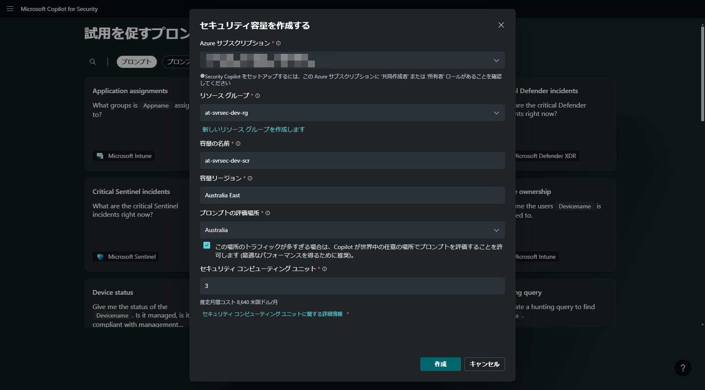
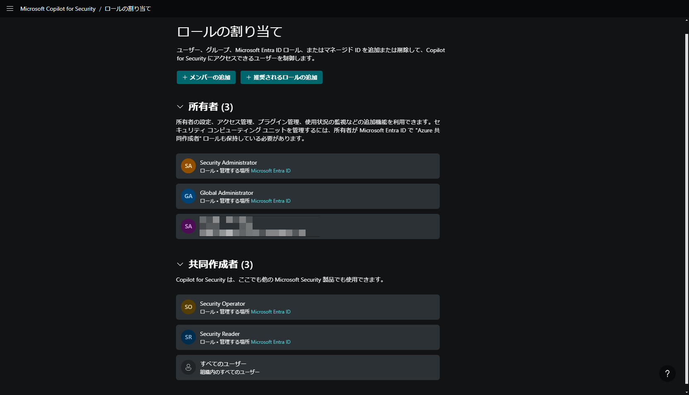

# ExXX: Microsoft Security Copilot の利用

#### ⏳ 推定時間: 40分

#### 💡 学習概要

#### 🗒️ 目次

1. Security Computing Unit (SCU) の プロビジョニング
1. Security Copilot の利用
1. プロンプトブックの参照と利用
1. SCU 使用量の確認
1. SCU の削除

## Security Computing Unit (SCU) の プロビジョニング

1. Security Copilot ポータルを開く

    https://securitycopilot.microsoft.com/

1. セキュリティ容量を作成する

    以下の設定を行って「作成」

    - Azure サブスクリプション: (本ハンズオンで利用するサブスクリプション)
    - リソースグループ: (本ハンズオンで利用するリソースグループ)
    - 容量の名前: (任意)
    - 容量リージョン: (プロンプトの評価場所を設定すると自動入力される)
    - プロンプトの評価場所: `Australia`
    - ✅ この場所のトラフィックが多すぎる場合は、Copilotが世界中の任意の場所でプロンプトを評価することを許可します
    - セキュリティコンピューティングユニット: `1`

    

1. 使用する容量を選択してくださいにて、作成した容量名を指定して「適用」

    - 容量名: (作成した容量名を選択)

    (*) エラーになる場合、画面更新して手動で設定（メニューの「所有者の設定」から行う）

    

1. 左上メニューを開き、「所有者の設定」を開く

    

1. 先ほど設定したSCUが設定されていることを確認

    

1. 左上メニューを開き、「ロールの割り当て」を開く

    

1. Security Copilot を利用できるユーザー/グループの設定が可能なことを確認

    - 所有者（Owner）: アクセス権管理および Security Copilot の機能の利用権限
    - 共同作成者（Contributor）: Security Copilot の機能の利用権限

    

## Security Copilot の利用

1. Security Copilot ポータルを開く

1. 左上メニューを開き、「マイセッション」を選択

    

1. 「新しいセッション」を選択

    

1. 「ソース」を開く

    

1. 以下のプラグインを有効化

    - Microsoft (Microsoft Defender XDR, Microsoft Entra など すべてを選択)
    - Webサイト

    

1. Microsoft Sentinel のプラグインにある「設定」を開く

    

1. Microsoft Sentinel に対する接続設定をして「保存」

    - Default workspace name: (作成した Sentinel のワークスペース名)
    - Default subscription name: (本ハンズオンで利用するサブスクリプション名)
    - Default resource group name: (本ハンズオンで利用するリソースグループ名)

    

1. 右上「×」で閉じる

    

1. 直近のインシデントについて問い合わせ

    - `直近のインシデントにはどのようなものがありますか？ 箇条書きでタイトルと要約を作成してください。`

    - `"Failed login attempts to Azure Portal" はどのようなインシデントですか？ 概要を教えてください。`

    - `特定IPアドレスからの Entra ID へのサインインを拒否するにはどのような設定が必要ですか？`

    

    うまく Copilot から回答が得られない場合、条件を具体的に記載するとうまく回答が得られる場合があります。
    いくつか表現を変更しながら試してみます。

    例    
    - 直近 → 過去24時間以内
    - インシデント → Microsoft Sentinel の インシデント

## プロンプトブックの参照と利用

1. Security Copilot ポータルを開く

1. 左上メニューを開き、「プロンプトブックのライブラリ」を開く

    

1. `Microsoft Sentinel incident investigation` を探して「再生」

    

1. 調査したいインシデント番号を Microsoft Sentinel から探してきて入力、「送信」

    

1. 指定したインシデントに関して情報がまとまって出てくることを確認

    

## SCU 使用量の確認

1. Security Copilot ポータルを開く

1. 左上メニューを開き、「使用量の監視」を開く

    

1. 1時間単位での使用量を確認

    使用量が多く Copilot が応答できなかった場合、赤色のバーで表示。
    赤で表示される個所が多い場合、ユニットの追加を検討。

    

## SCU の削除

1. Security Copilot ポータルを開く

1. 左上メニューを開き、「所有者の設定」を開く

    

1. セキュリティコンピューティングユニットにある「変更」を選択

    

1. 詳細を表示し、「容量の削除」を選択

    

1. 確認画面で「はい」を選択

(*) 削除がうまくできない場合、または 削除できたことを確認したい場合、Azureポータルから確認

1. Azure ポータルを開き、`Microsoft Security Copilot compute capacities` を探して開く

1. 作成済みの SCU を開く

    

1. 「削除」を選択

    

